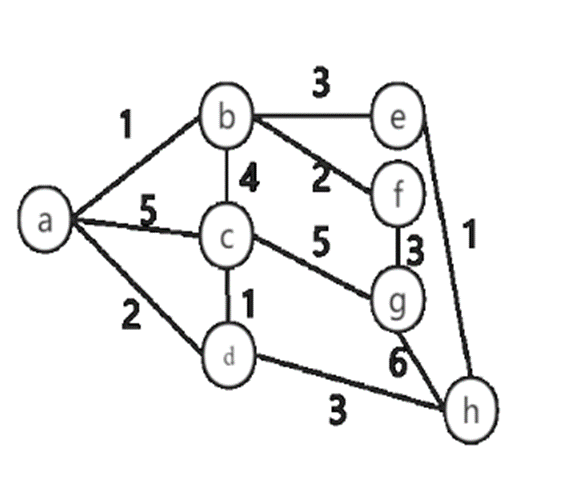

### Test 2 (Week 12)

1. 活动选择问题：假定有一个$n$个活动的集合，这些活动使用同一个资源，而这个资源在某个时刻只能供一个活动使用。每个活动都有一个开始时间$s$和一个结束时间$f$，如果被选中，任务$a_i$发生在半开时间区间$[s_i,f_i)$期间。如果两个活动$a_i$和$a_j$和满足$[s_i,f_i)$和$[s_j,f_j)$不重叠，则称它们是兼容的。我们希望选出一个最大兼容活动集.

2. $DAG$中最长路径的算法设计，写出$bellman$方程，并进行时间复杂度分析.

3. 简述拓扑排序算法思想与伪代码.

4. 如图，

   

   计算上图的最小生成树，并输出最小生成树的结构与其权值和.