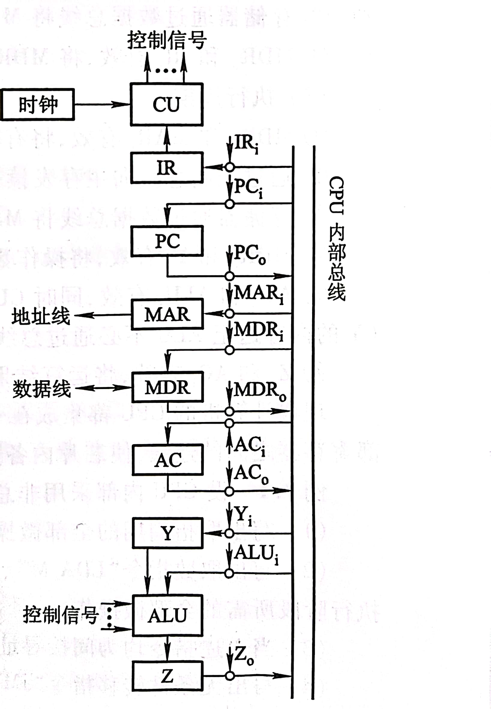

### Test 6 (Week 14)

1. 某计算机的主频为6MHz，各类指令的平均执行时间和使用频度如下表所示，试计算该机的速度（单位用MIPS表示），若上述CPU芯片升级为10MHz，则该机的速度又为多少？

   | 指令类别         | 存取  | 加、减、比较、转移 | 乘除 | 其它  |
   | ---------------- | ----- | ------------------ | ---- | ----- |
   | 平均指令执行时间 | 0.6µs | 0.8µs              | 10µs | 1.4µs |
   | 使用频度         | 35%   | 45%                | 5%   | 15%   |

2. 设CPU内部结构如图所示，此外还设有B、C、D、E、H、L六个寄存器，它们各自的输入和输出端都与内部总线相通，并分别受控制信号控制（如Bi为寄存器B的输入控制；Bo为B的输出控制）。要求从取指令开始，写出完成下列指令所需的全部微操作和控制信号

    

    （1）ADD B，C    ((B)+(C) ->B)

    （2）SUB A,H     ((AC)-(H) ->AC)

3. 设CPU内部结构如图所示，此外还设有R1~R4四个寄存器，它们各自的输入和输出端都与内部总线相通，并分别受控制信号控制（如R2i为寄存器R2的输入控制；R2o为R2的输出控制）。要求从取指令开始，写出完成下列指令所需的全部微操作和控制信号。

    
    
    （1）ADD R2，@R4 ；((R2)+((R4)) ->R2，寄存器间接寻址)

4. 设机器A的主频为8MHz，机器周期含4个时钟周期，且该机的平均指令执行速度是0.4MIPS，试求该机的平均指令周期和机器周期，每个指令周期中含几个机器周期？如果机器B的主频为12MHz，且机器周期也含4个时钟周期，试问B机的平均指令执行速度为多少MIPS?

5. 试比较同步控制、异步控制和联合控制的区别。

