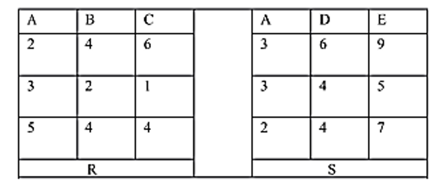

### Test 2 (Week 12)

1. 关系代数：

   设R和S是下图的关系，计算下列关系代数表达式和元组表达式的值：

   

   1. R自然连接S
   2. $σ_{A<E}(R×S)$
   3. $\left\{\mathrm{t} \mid \mathrm{t} \in \mathrm{R}^{\wedge} \forall u \in s \quad(\mathrm{t}[\mathrm{A}]<\mathrm{u}[\mathrm{E}])\right\}$

2. ER模型：一个工厂有若干仓库：每一仓库有若干职工作为仓库管理员，职工之间有领导与被领导的关系：仓库中保存工厂生产的多种零件。用ER图表示上述内容，关注仓库面积、仓库中保存零件的种类、每种零件的入库时间及入库数量，职工的姓名、职称、职务及工资待遇，零件的颜色、成木及出厂价。并将ER图转换成相应的关系模型(10分)

3. SQL：有关系S(SNO,SNAME DEPT),C(CNO,CNAME),SC(SNO,CNO,SCORE).关系S、C和SC分别表示学生信息、课程信息和学生选课情况.请按要求表达下列查询.(35分)

   其属性分别表示如下：

   SNO一学生编号，SNAE一学生姓名，DEPT一学生所在系，CNO一课程编号，

   CNAME一课程名称，SCORE一成绩.

   1.分别使用SQL语句、关系代数和元组关系演算，求选修了课程号为C4的学生的学号及成数

   

   2.分别使用SQL语句I关系代数，求计算机系所有学生的成绩，包括SNO, SNAME, CNO, CNAME, SCORE

   

   3.使用一SQL语句，求数据库课程的平均成绩

   

   4.分别使用关系代数和SQI语句，求没有学习C1课程的学生姓名

   

   5.使用一SQL语句，求出有2门以上成绩为优（>=90)的学生学号

   

   6.分别使用SQL语句、关系代数和元组关系演算，求选修了学生s3所达全部课程的学生学号

   

   7.使用一SQL语句，将所有课程的分数加5分

   

   8.使用一SQL语句，对计算机系学生的成绩，如低于本门课程平均成绩的一半，则提高5%