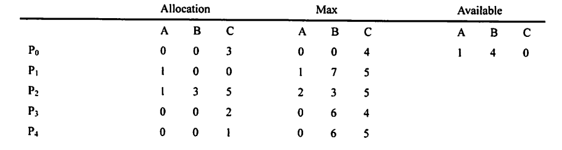

### Test 1 (Week 11)

1. 请解释使用Time Sharing 和Multiprogramming的意义，请比较Layered Approch，MicroKernal，Virtual Machine的特点和区别。(2022)

2. 画出进程NEW、READY、RUNNING、WAITING、TERMINATED的状态图，并说明状态之间变换的原因；请解释在一个线程blocking时，是否能够运行相应的进程，为什么？(2022)

3. 现有5个操作A、B、C、D和E,操作C必须在A和B完成后执行，操作E必须在C和D完成后执行，请使用信号量的wait()、signal()操作(P、V操作)描述上述操作之间的同步关系，并说明所用信号量及其初值。[2020统考真题]

4. 给定下面的作业顺序：

   | **进程号** | **到达时间** | **运行时间** |
   | ---------- | ------------ | ------------ |
   | P1         | 0.0          | 7.0          |
   | P2         | 1.0          | 4.0          |
   | P3         | 2.0          | 1.0          |
   | P4         | 3.0          | 4.0          |

    (1) 请使用最短作业优先算法画出甘特图，计算平均等待时间；

    (2) 请使用最短剩余时间优先算法画出甘特图，计算平均等待时间。[2022]

5. 假设具有5个进程的进程集合P={P0,P1,P2,P,P4},系统中有三类资源A,B,C,假设在某时刻有如下状态：

   

   当前系统是否处于安全状态？若系统中的可利用资源Available为(0,6,2)，系统是否安全？若系统处在安全状态，请给出安全序列；若系统处在非安全状态，简要说明原因。[银行家算法]