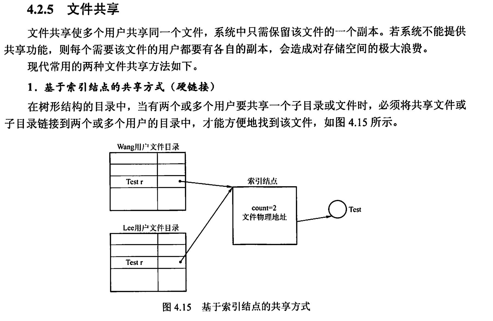
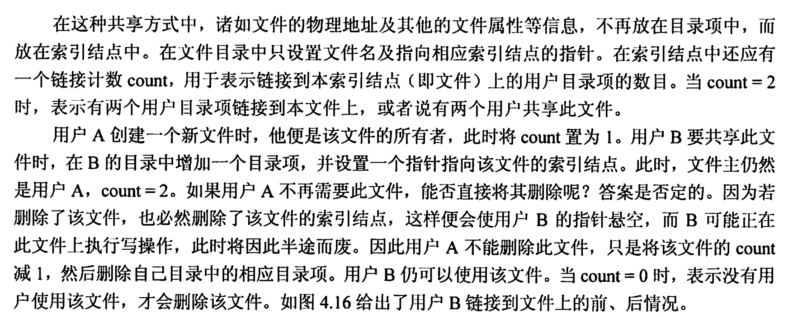
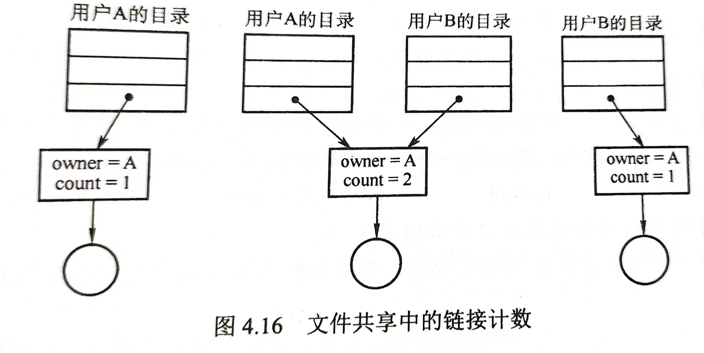
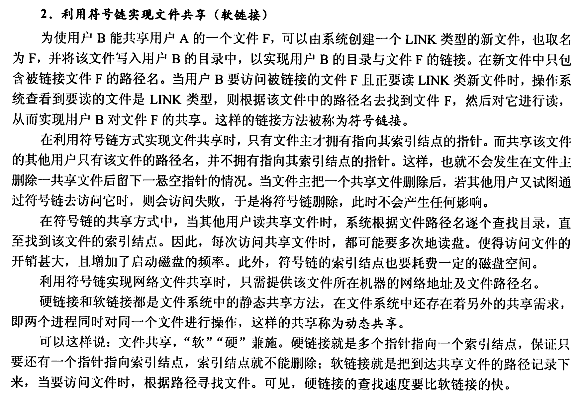
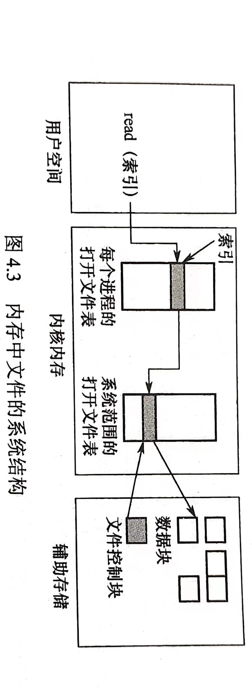

### Test 5(Week 15)

1. [内存管理]解释全局转置和局部转置换的特点和优缺点。给定页面访问顺序，分配4个物理块，采用LRU算法给出相应的置换图和缺页中断的次数。（10分）[2022]
   $$
   7,0,1,2,0,3,0,4,2,3,0,3,0,3,2,1,2,0,1
   $$

   [解答]

   - 在请求分页系统中，可采取两种内存分配策略，即固定和可变分配策略。在进行置换时，也可采取两种策略，即全局置换和局部置换。于是可组合出下面三种适用的策略。

     (1)固定分配局部置换

   - 为每个进程分配一定数目的物理块，在进程运行期间都不改变。所谓局部置换，是指如果进程在运行中发生缺页，则只能从分配给该进程在内存的页面中选出一页换出，然后再调入一页，以保证分配给该进程的内存空间不变。实现这种策略时，难以确定应为每个进程分配的物理块数目：太少会频繁出现缺页中断，太多又会降低CPU和其他资源的利用率。

     (2)可变分配全局置换

   - 先为每个进程分配一定数目的物理块，在进程运行期间可根据情况适当地增加或减少。所谓全局置换，是指如果进程在运行中发生缺页，系统从空闲物理块队列中取出一块分配给该进程，并将所缺页调入。这种方法比固定分配局部置换更加灵活，可以动态增加进程的物理块，但也存在弊端，如它会盲目地给进程增加物理块，从而导致系统多道程序的并发能力下降。

     (3)可变分配局部置换

   - 为每个进程分配一定数目的物理块，当某进程发生缺页时，只允许从该进程在内存的页面中选出一页换出，因此不会影响其他进程的运行。若进程在运行中频繁地发生缺页中断，则系统再为该进程分配若干物理块，直至该进程的缺页率趋于适当程度：反之，若进程在运行中的缺页率特别低，则可适当减少分配给该进程的物理块，但不能引起其缺页率的明显增加。这种方法在保证进程不会过多地调页的同时，也保持了系统的多道程序并发能力。当然它需要更复杂的实现，也需要更大的开销，但对比频繁地换入/换出所浪费的计算机资源，这种牺牲是值得的。

2. [文件管理]结合目录结构的文件系统，提出设计方案，实现文件系统内文件的共享。（在实现目录管理的文件系统中，描述实现文件共享的几种解决方法和设计思想。）

    

    

    

    

3. [文件管理]磁盘柱面编号为0~299， 当前磁头位于编号为80的柱面，有以下任务请求同时到达，主码编号为 20、198、256、76、57、126、270、109、200. 求以下两种磁盘调度算法的寻道距离。（10分）
   （1）最短时间优先算法（SSTF）
   （2）LOOK（当前磁头向柱面编号增大的方向移动）

4. [文件管理]请解释在给定文件地址的条件下，使用`open()`系统调用的过程中第一次用打开文件，操作系统从传入路径数据到返回描述符的内部工作流程。另外，操作系统是如何支持多进程打开操作同一文件。[2022]

   [解答]

   - 当用户对一个文件实施操作时，每次都要从检索目录开始。为了避免多次重复地检索目录，大多数操作系统要求，在文件使用之前通过系统调用open被显式地打开。操作系统维护一个包含所有打开文件信息的表（打开文件表）。所谓“打开”，是指调用open根据文件名搜索目录，将指明文件的属性（包括该文件在外存上的物理位置），从外存复制到内存打开文件表的一个表目中，并将该表目的编号（也称索引）返回给用户。当用户再次向系统发出文件操作请求时，可通过索引在打开文件表中查到文件信息，从而节省再次搜索目录的开销。当文件不再使用时，可利用系统调用close关闭它，操作系统将会从打开文件表中删除这一条目。

   - 在多个不同进程可以同时打开文件的操作系统中，通常采用两级表：每个进程表和整个系统表。每个进程表根据它打开的所有文件，表中存储的是进程对文件的使用信息。系统打开文件表包含文件相关信息，如文件在磁盘的位置、访问日期和大小。一旦有进程打开了一个文件，系统表就包含该文件的条目。当另一个进程执行调用opn时，只不过是在其进程打开表中增加一个条目，并指向系统表的相应条目。通常，系统打开文件表为每个文件关联一个打开计数器（Open Count),以记录多少进程打开了该文件。每个关闭操作close使count递减，当打开计数器为0时，表示该文件不再被使用，并且可从系统打开文件表中删除相应条目。

   - 文件名不必是打开文件表的一部分，因为一旦完成对FCB在磁盘上的定位，系统就不再使用文件名。对于访问打开文件表的索引，UNIX称之为文件描述符，而Windows称之为文件句柄。因此，只要文件未被关闭，所有文件操作就通过打开文件表来进行。

     

   - 每个打开文件都具有如下关联信息：

   - 文件指针。系统跟踪上次的读写位置作为当前文件位置的指针，这种指针对打开文件的某个进程来说是唯一的，因此必须与磁盘文件属性分开保存。

   - 文件打开计数。计数器跟踪当前文件打开和关闭的数量。因为多个进程可能打开同一个文件，所以系统在删除打开文件条目之前，必须等待最后一个进程关闭文件。

   - 文件磁盘位置。大多数文件操作要求系统修改文件数据。查找磁盘上的文件所需的信息保存在内存中，以便系统不必为每个操作都从磁盘上读取该信息。

   - 访问权限。每个进程打开文件都需要有一个访问模式(创建、只读、读写、添加等)。该信息保存在进程的打开文件表中，以便操作系统能够允许或拒绝后续的I/O请求。