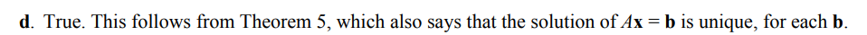
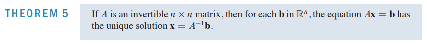
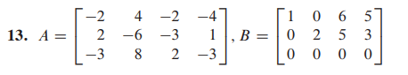
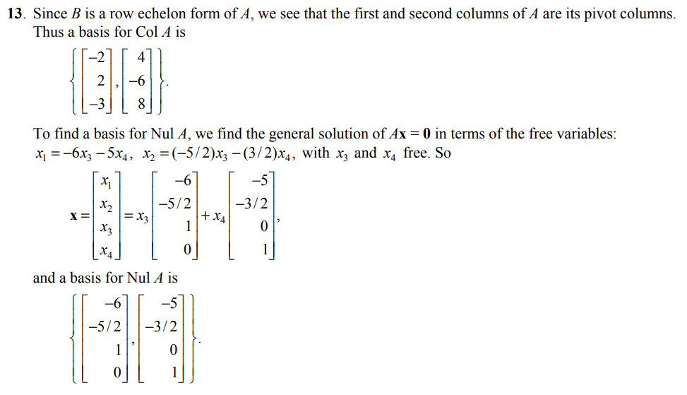
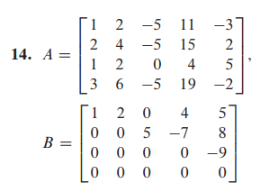
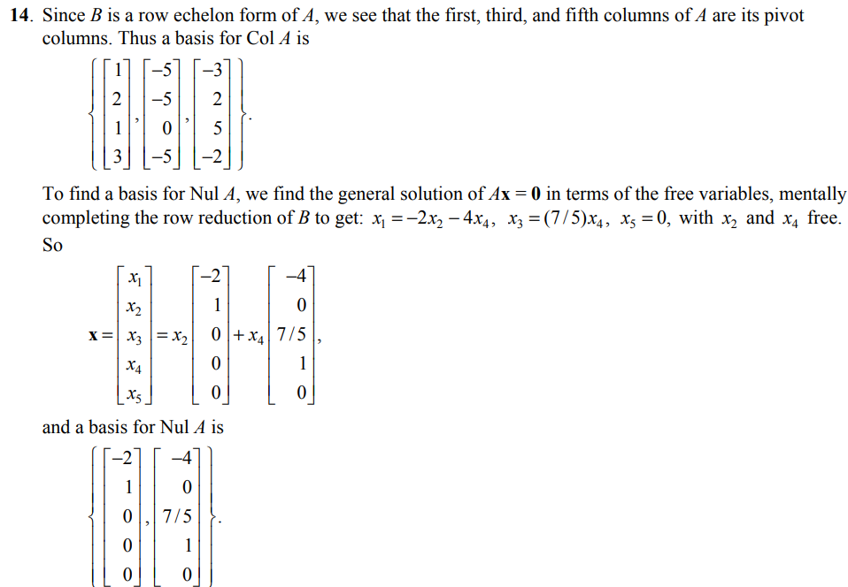
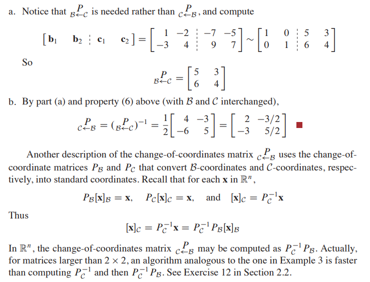

#### Linear Algebra
时间:2022年04月04日

PDF Link

```pdf
/linear_algebra/pdf/linear_algebra_week7-pdf.pdf
```


一、判断正误
1. Every matrix is row equivalent to a unique matrix in echelon form.()
   <details> 
   <summary>解析</summary>

   False
   教材13页定理一 
   每个矩阵行等价于唯一的简化阶梯型矩阵。
   </details>

2. If $A$ is an invertible $n{\times} n$ matrix, then the equation $Ax = b$ is consistent for each $b$ in ${\R}^n$.()
   <details>
      <summary>解析</summary>

      True
      教材104页定理五
      
      
   </details>

   <video id="video" controls="" preload="none" poster="封面">
         <source id="mp4" src="/linear_algebra/linear_algebra_01/video.mp4" type="video/mp4">
   </videos>


二、计算
1. Find bases for $Nul A$ and $Col A$.

   a.
   $$
   A =
   \begin{bmatrix}
   -2&4&-2&-4\\
   2&-6&-3&1\\
   -3&8&2&-3\\
   \end{bmatrix}\\
   $$

   <details><summary>解析</summary>

   1. 化为阶梯型矩阵，含有主元列的构成列空间。
   2. 求解矩阵的零空间--->解$Ax=0$
   3. 
   
   </details>
   b.

   $$
   A = \begin{bmatrix}
      1&2&0&4&5\\
      0&0&5&-7&8\\
      0&0&0&0&-9\\
      0&0&0&0&0\\
      \end{bmatrix}\\
   $$

   <details><summary>解析</summary>
   
   
   
   </details>

2. Let $\mathbf{b}_{1}=\left[\begin{array}{r}1 \\ -3\end{array}\right], \mathbf{b}_{2}=\left[\begin{array}{r}-2 \\ 4\end{array}\right], \mathbf{c}_{1}=\left[\begin{array}{r}-7 \\ 9\end{array}\right], \mathbf{c}_{2}=\left[\begin{array}{r}-5 \\ 7\end{array}\right]$, and consider the bases for $\mathbb{R}^{2}$ given by $\mathcal{B}=\left\{\mathbf{b}_{1}, \mathbf{b}_{2}\right\}$ and $\mathcal{C}=\left\{\mathbf{c}_{1}, \mathbf{c}_{2}\right\}$
a. Find the change-of-coordinates matrix from $\mathcal{C}$ to $\mathcal{B}$.
b. Find the change-of-coordinates matrix from $\mathcal{B}$ to $\mathcal{C}$.

   <details>
   <summary>解答</summary>
   
   这里我们知道

      
   </details>


三、证明
1. 设$A$是$n$阶矩阵，若$A^2 = A$，证明$A+E$可逆.

      <details>
      <summary>解析</summary>
      
      证明:由于$A^2- A = 0$,我们想要证明$(A+E)(?)=E$,那么如何求解$?$处的表达式呢？我们知道这样的因式分解是可以配凑的，于是$(A+E)(A-2E) = -2E$,这里的配凑我们显然需要利用$A^2-A = 0$这个现成的表达式来证明。那么我们可以找到$(?) = \frac{A-2E}{-2}$,说明$A+E$可逆，证毕。
      
      大家可以思考本题是否还有其他解法，采用特征值证明??
      </details>

2. 设$A$是$m{\times}n$矩阵，$B$是$n{\times}s$矩阵，若$AB=O$，证明$rank(A)+rank(B){\leq}n$.

      <details>
      <summary>解析</summary>

      分析：总体思路：采用矩阵分块的方式求解.题目具有一定难度.

      证明：
      对矩阵$B$按照列分块，我们记$B$ = $\begin{bmatrix}{\beta}_1&{\beta}_2&{\beta}_3&{\cdots}& {\beta}_s\\
      \end{bmatrix}\\$
      那么有
      $$
      \begin{aligned}
      AB&=A\begin{bmatrix}
      {\beta}_1&{\beta}_2&{\beta}_3&{\cdots}& {\beta}_s\\
      \end{bmatrix} \\ &= \begin{bmatrix}
      A{\beta}_1&A{\beta}_2&A{\beta}_3&{\cdots}& A{\beta}_s\\
      \end{bmatrix} \\
      & = \begin{bmatrix}
      \vec{0}&\vec{0}&\vec{0}&{\cdots}& \vec{0}\\
      \end{bmatrix}
      \end{aligned}
      $$
      于是我们有$A{\beta}_j = \vec{0},j = 1,2,3,{\cdots},s$,
      所以$B$的列向量都是齐次方程组$A\vec{x} = \vec{0}$的解，由于方程组$A{\vec{x}} = \vec{0}$的解向量的$rank(\vec{x}) = n - rank(A)$,这里的$\vec{x}$与$\vec{\beta}$含义等价，所以
      $$
      rank( {\beta}_1,{\beta}_2,{\beta}_3,{\cdots}, {\beta}_s){\leq}n-rank(A)
      $$
      我们又知道
      $$
      rank( {\beta}_1,{\beta}_2,{\beta}_3,{\cdots}, {\beta}_s) = rank(B)
      $$
      所以：$rank(A)+rank(B){\leq}n$.
      </details>

