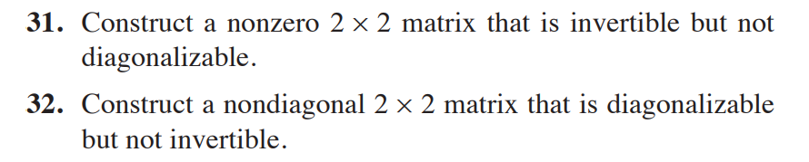

### Linear Algebra 02

时间：2022年04月09日

1. If an augmented matrix $\left[\begin{array}{ll}A & \mathbf{b}\end{array}\right]$ is transformed into $\left[\begin{array}{ll}C & \mathbf{d}\end{array}\right]$ by elementary row operations, then the equations $A \mathbf{x}=\mathbf{b}$ and $C \mathbf{x}=\mathbf{d}$ have exactly the same solution sets. (T/F?)

​	[解答]

True. See the box after the definition of elementary row operations, in Section 1.1. If $\left[\begin{array}{ll}A & \mathbf{b}\end{array}\right]$ is transformed into $\left[\begin{array}{ll}C & \mathbf{d}] \text { by elementary row operations, then the two augmented matrices are row }\end{array}\right.$ equivalent.

1. Find a basis for the set of all vectors of the form $\left[\begin{array}{c}a-2 b+5 c \\ 2 a+5 b-8 c \\ -a-4 b+7 c \\ 3 a+b+c\end{array}\right]$.(Be careful.)

   [解答]

   The set is Span $S$, where $S=\left\{\left[\begin{array}{r}1 \\ 2 \\ -1 \\ 3\end{array}\right],\left[\begin{array}{r}-2 \\ 5 \\ -4 \\ 1\end{array}\right],\left[\begin{array}{r}5 \\ -8 \\ 7 \\ 1\end{array}\right]\right\}$. Note that $S$ is a linearly dependent set, but each pair of vectors in $S$ forms a linearly independent set. Thus any two of the three vectors $\left[\begin{array}{r}1 \\ 2 \\ -1 \\ 3\end{array}\right],\left[\begin{array}{r}-2 \\ 5 \\ -4 \\ 1\end{array}\right],\left[\begin{array}{r}5 \\ -8 \\ 7 \\ 1\end{array}\right]$will be a basis for Span $S$.

2. $$
   T=\left[\begin{array}{lll}
   1 & a & a^{2} \\
   1 & b & b^{2} \\
   1 & c & c^{2}
   \end{array}\right]
   $$

   

​        Show that $\operatorname{det} T=(b-a)(c-a)(c-b)$.

   [解答]

   $\begin{aligned} \operatorname{det} T &=\left|\begin{array}{lll}1 & a & a^{2} \\ 1 & b & b^{2} \\ 1 & c & c^{2}\end{array}\right|=\left|\begin{array}{ccc}1 & a & a^{2} \\ 0 & b-a & b^{2}-a^{2} \\ 0 & c-a & c^{2}-a^{2}\end{array}\right|=\left|\begin{array}{ccc}1 & a & a^{2} \\ 0 & b-a & (b-a)(b+a) \\ 0 & c-a & (c-a)(c+a)\end{array}\right| \\ &=(b-a)(c-a)\left|\begin{array}{ccc}1 & a & a^{2} \\ 0 & 1 & b+a \\ 0 & 1 & c+a\end{array}\right|=(b-a)(c-a)\left|\begin{array}{ccc}1 & a & a^{2} \\ 0 & 1 & b+a \\ 0 & 0 & c-b\end{array}\right|=(b-a)(c-a)(c-b) \end{aligned}$

   

3. 设有实矩阵 $A=\left[\begin{array}{ccc}1 & 2 & 3 \\ 2 & 3 & 5 \\ 1 & 1 & a\end{array}\right] ， B=\left[\begin{array}{ccc}1 & b & c \\ 2 & b^{2} & c+1\end{array}\right]$ ，其中 $a, b, c$ 为实常数. 已知齐次线性方程组 $A X=0$ 和 $B X=0$ 同解，试求 $a, b, c$ 的值. 

   [解答]

   解:由题意，矩阵 $A$ 和 $B$ 必然有相同的秩，从而 $A$ 必然不满秩，于是
   $$
   \operatorname{det} A=\operatorname{det}\left[\begin{array}{lll}
   1 & 2 & 3 \\
   1 & 1 & 2 \\
   1 & 1 & a
   \end{array}\right]=0
   $$
   得 $a=2$.
   设 $X=\left(x_{1}, x_{2}, x_{3}\right)^{T}$ ，解方程组 $A X=0$ 得 $X=t(1,1,-1)^{T}$ ，其中 $t$ 为任意实数. 这也说明两个方程组的解空间维数都是 1 ，从而矩阵 $A$ 和 $B$ 的秩都是 2 .
   令 $B\left[\begin{array}{c}1 \\ 1 \\ -1\end{array}\right]=0$ ，得 $\left\{\begin{array}{l}b-c+1=0 \\ b^{2}-c+1=0\end{array}\right.$ ，解得 $\left\{\begin{array}{l}b=0 \\ c=1\end{array}\right.$ 或 $\left\{\begin{array}{l}b=1 \\ c=2\end{array}\right.$.
   进一步计算可得，当 $b=0, c=1$ 时， $B$ 的两行线性相关，此时 $B$ 的秩为 1 ；而当 $b=1, c=2$ 时， $B$ 的两行线性无关，此时 $B$ 的秩为 2 .
   综上所述， $a=2, b=1, c=2$.

   

4. 证明替换定理：设向量组 $\left\{\boldsymbol{\alpha}_{1}, \boldsymbol{\alpha}_{2}, \ldots, \boldsymbol{\alpha}_{s}\right\}$ 线性无关，$\boldsymbol{\beta}=b_{1} \boldsymbol{\alpha}_{1}+b_{2} \boldsymbol{\alpha}_{2}+\cdots+b_{s} \boldsymbol{\alpha}_{s}$. 如果 $b_{i} \neq 0$ ，那么用 $\boldsymbol{\beta}$ 替换 $\boldsymbol{\boldsymbol { \alpha } _ { i }}$ 后得到的向量组 $\left\{\boldsymbol{\alpha}_{1}, \boldsymbol{\alpha}_{2}, \ldots, \boldsymbol{\alpha}_{i-1}, \boldsymbol{\beta}, \boldsymbol{\alpha}_{i+1}, \ldots, \boldsymbol{\alpha}_{s}\right\}$ 也线性无关.
   [解答]

   证明：设存在标量 $c_{1}, c_{2}, \ldots, c_{s}$ 使得
   $$
   c_{1} \boldsymbol{\alpha}_{1}+c_{2} \boldsymbol{\alpha}_{2}+\cdots+c_{i-1} \boldsymbol{\alpha}_{i-1}+c_{i} \boldsymbol{\beta}+c_{i+1} \boldsymbol{\alpha}_{i+1}+\cdots+c_{s} \boldsymbol{\alpha}_{s}=0
   $$
   即
   $$
   \left(c_{i} b_{1}+c_{1}\right) \boldsymbol{\alpha}_{1}+\left(c_{i} b_{2}+c_{2}\right) \boldsymbol{\alpha}_{2}+\cdots+\left(c_{i} b_{i-1}+c_{i-1}\right) \boldsymbol{\alpha}_{i-1}+b_{i} \boldsymbol{\alpha}_{i}+\left(c_{i} b_{i+1}+c_{i+1}\right) \boldsymbol{\alpha}_{i+1}+\cdots+\left(c_{i} b_{s}+c_{s}\right) \boldsymbol{\alpha}_{s}=0
   $$
   因为向量组 $\left\{\boldsymbol{\alpha}_{1}, \boldsymbol{\alpha}_{2}, \ldots, \boldsymbol{\alpha}_{s}\right\}$ 线性无关，所以
   $$
   c_{i} b_{1}+c_{1}=c_{i} b_{2}+c_{2}=\cdots=c_{i} b_{i-1}+c_{i-1}=b_{i} c_{i}=c_{i} b_{i+1}+c_{i+1}=\cdots=c_{i} b_{s}+c_{s}=0
   $$
   因为 $b_{i} \neq 0$ ，所以 $c_{i}=0$ ，所以 $c_{1}=c_{2}=\cdots=c_{n}=0$.
   这说明向量组 $\left\{\boldsymbol{\alpha}_{1}, \boldsymbol{\alpha}_{2}, \ldots, \boldsymbol{\alpha}_{i-1}, \boldsymbol{\beta}, \boldsymbol{\alpha}_{i+1}, \ldots, \boldsymbol{\alpha}_{s}\right\}$ 是线性无关的.

5. 问题解答：

   

   [解答]

   