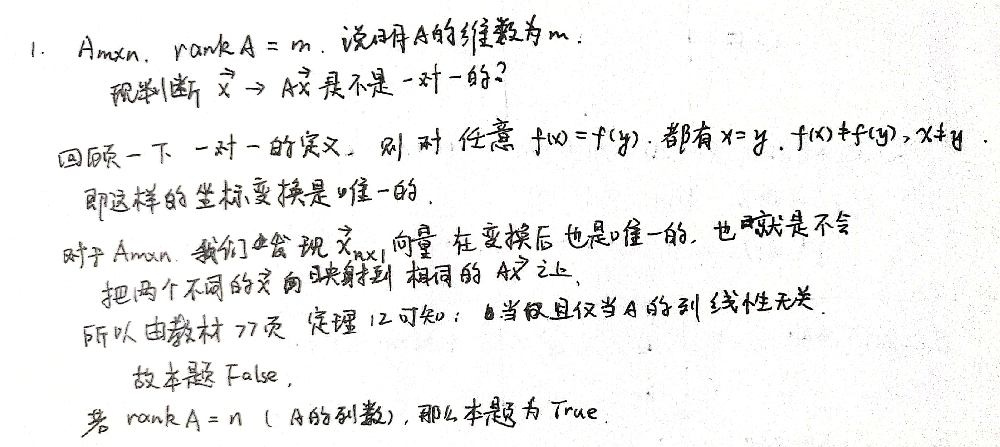
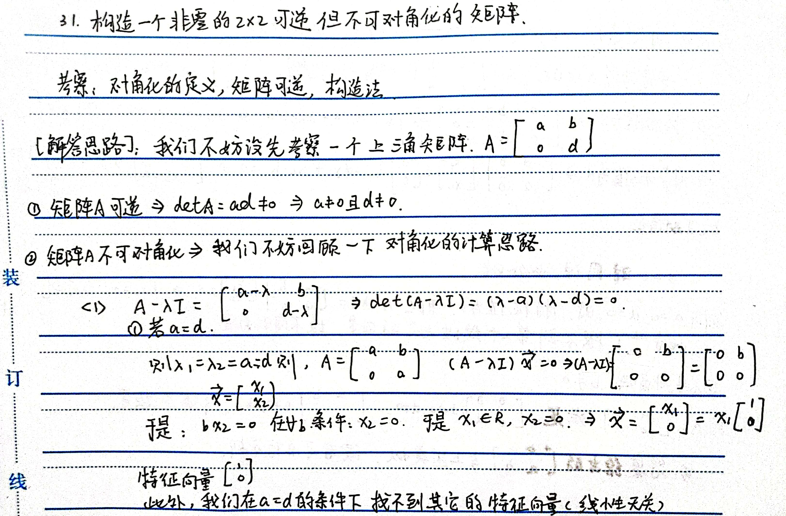
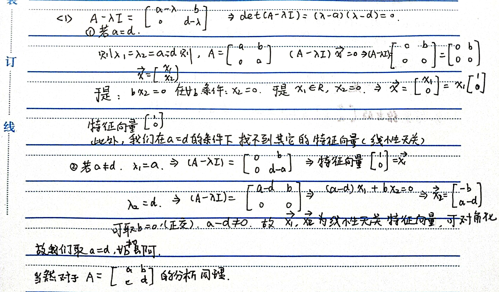
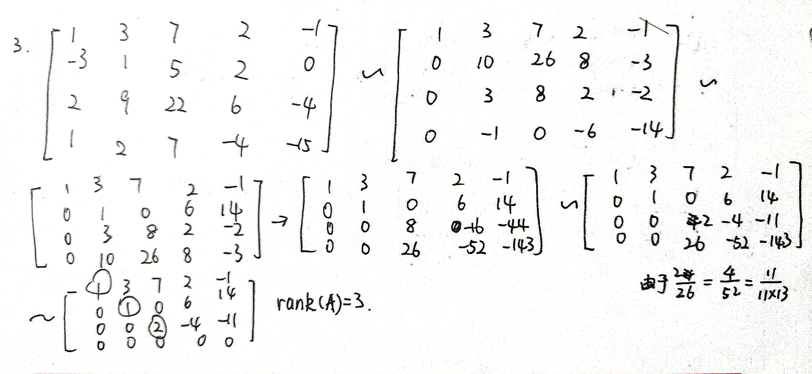
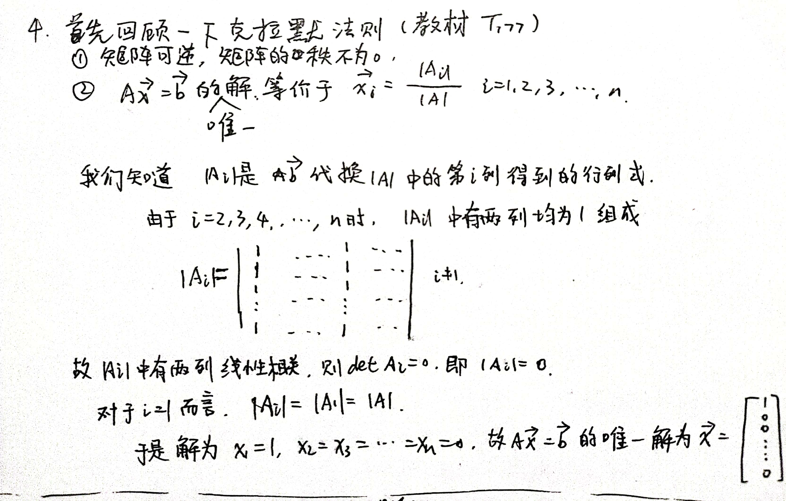

### Linear Algebra 03

时间：2022年4月21日

1. If $A$ is $m \times n$ and $\operatorname{rank} A=m$, then the linear transformation $\mathbf{x} \mapsto A \mathbf{x}$ is one-to-one. (T/F?)

   A. False. Counterexample: $A=\left[\begin{array}{lll}1 & 0 & 0 \\ 0 & 1 & 0\end{array}\right]$. If rank $A=n$ (the number of columns in $A$ ), then the transformation $\mathbf{x} \mapsto A \mathbf{x}$ is one-to-one.

   

2. Construct a nonzero $2 \times 2$ matrix that is invertible but not diagonalizable.

​    [解答]

3. 用初等变换法求矩阵 $\boldsymbol{A}=\left[\begin{array}{ccccc}1 & 3 & 7 & 2 & -1 \\ -3 & 1 & 5 & 2 & 0 \\ 2 & 9 & 22 & 6 & -4 \\ 1 & 2 & 7 & -4 & -15\end{array}\right]$ 的秩.

【解析】
$\boldsymbol{A}=\left[\begin{array}{ccccc}1 & 3 & 7 & 2 & -1 \\ -3 & 1 & 5 & 2 & 0 \\ 2 & 9 & 22 & 6 & -4 \\ 1 & 2 & 7 & -4 & -15\end{array}\right] \rightarrow\left[\begin{array}{ccccc}1 & 3 & 7 & 2 & -1 \\ 0 & 10 & 26 & 8 & -3 \\ 0 & 3 & 8 & 2 & -2 \\ 0 & -1 & 0 & -6 & -14\end{array}\right]$
$\rightarrow\left[\begin{array}{ccccc}1 & 3 & 7 & 2 & -1 \\ 0 & 1 & 0 & 6 & 14 \\ 0 & 3 & 8 & 2 & -2 \\ 0 & 10 & 26 & 8 & -3\end{array}\right] \rightarrow\left[\begin{array}{ccccc}1 & 3 & 7 & 2 & -1 \\ 0 & 1 & 0 & 6 & 14 \\ 0 & 0 & 8 & -16 & -44 \\ 0 & 0 & 26 & -52 & -143\end{array}\right]$
$$
\rightarrow\left[\begin{array}{ccccc}
1 & 3 & 7 & 2 & -1 \\
0 & 1 & 0 & 6 & 14 \\
0 & 0 & 8 & -16 & -44 \\
0 & 0 & 0 & 0 & 0
\end{array}\right] .
$$
从而得 $r(\boldsymbol{A})=3$.

4. 设 $a_{1}, a_{2}, {a_3}, a_{4},{a_5}$ 是互不相同的实数, 且

$$
\boldsymbol{A}=\left[\begin{array}{ccccc}
1 & a_{1} & a_{1}^{2} & \cdots & a_{1}^{4} \\
1 & a_{2} & a_{2}^{2} & \cdots & a_{2}^{4} \\
\vdots & \vdots & \vdots & & \vdots \\
1 & a_{5} & a_{5}^{2} & \cdots & a_{5}^{4}
\end{array}\right], \boldsymbol{x}=\left[\begin{array}{c}
x_{1} \\
x_{2} \\
\vdots \\
x_{5}
\end{array}\right], \boldsymbol{b}=\left[\begin{array}{c}
1 \\
1 \\
\vdots \\
1
\end{array}\right]
$$
   求线性方程组 $A x=b$ 的解.

(4的推广，供有兴趣的同学尝试)

5. 设 $a_{1}, a_{2}, \cdots, a_{n}$ 是互不相同的实数, 且

$$
\boldsymbol{A}=\left[\begin{array}{ccccc}
1 & a_{1} & a_{1}^{2} & \cdots & a_{1}^{n-1} \\
1 & a_{2} & a_{2}^{2} & \cdots & a_{2}^{n-1} \\
\vdots & \vdots & \vdots & & \vdots \\
1 & a_{n} & a_{n}^{2} & \cdots & a_{n}^{n-1}
\end{array}\right], \boldsymbol{x}=\left[\begin{array}{c}
x_{1} \\
x_{2} \\
\vdots \\
x_{n}
\end{array}\right], \boldsymbol{b}=\left[\begin{array}{c}
1 \\
1 \\
\vdots \\
1
\end{array}\right]
$$
求线性方程组 $A x=b$ 的解.

15.【解析】因 $a_{1}, a_{2}, \cdots, a_{n}$ 互不相同, 故由范德蒙德行列式知, $|\boldsymbol{A}| \neq 0$, 根据克拉跁法则,方程组 $\boldsymbol{A x}=\boldsymbol{b}$ 有唯一解, 且
$$
x_{i}=\frac{\left|\boldsymbol{A}_{i}\right|}{|\boldsymbol{A}|}, i=1,2, \cdots, n \text {, }
$$
其中, $\left|\boldsymbol{A}_{i}\right|$ 是 $\boldsymbol{b}$ 代换 $|\boldsymbol{A}|$ 中第 $i$ 列所得的行列式, 有
$$
\left|\boldsymbol{A}_{1}\right|=|\boldsymbol{A}|,\left|\boldsymbol{A}_{i}\right|=0, i=2,3, \cdots, n,
$$
故 $\boldsymbol{A x}=\boldsymbol{b}$ 的唯一解为 $\boldsymbol{x}=[1,0,0, \cdots, 0]^{\mathrm{T}}$.

证明范德蒙德行列式：

[范德蒙行列式 - 知乎 (zhihu.com)](https://zhuanlan.zhihu.com/p/161300510)

可以建议linear_algebra_04参考

[测试1]

b. If $A$ is $m \times n$ and the linear transformation $\mathbf{x} \mapsto A \mathbf{x}$ is onto, then $\operatorname{rank} A=m$. (T/F?)

B. True. If $\mathbf{x} \mapsto A \mathbf{x}$ is onto, then $\operatorname{Col} A=\mathbb{R}^{m}$ and rank $A=m$. See Theorem 12(a) in Section 1.9.

[测试2]

  b. Construct a nondiagonal $2 \times 2$ matrix that is diagonalizable but not invertible.