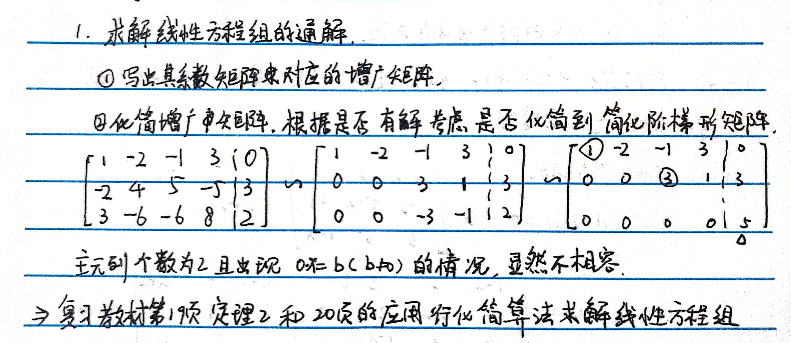
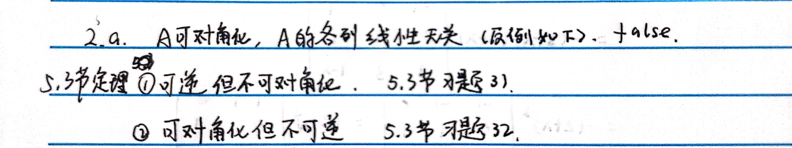
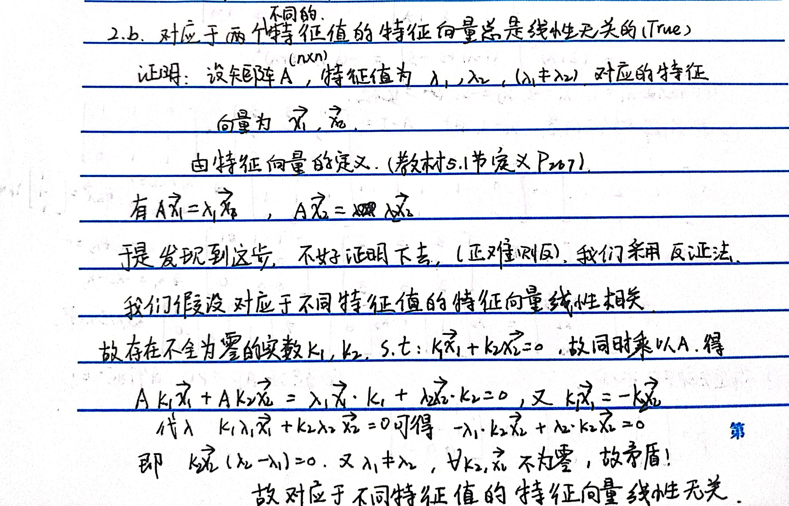
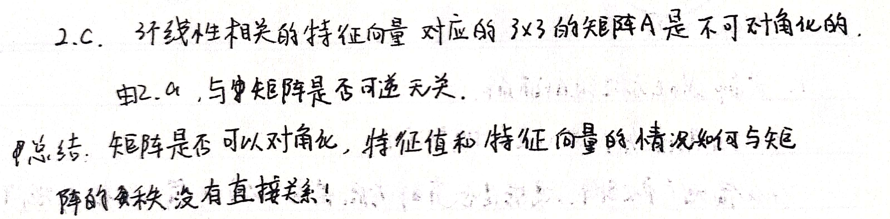
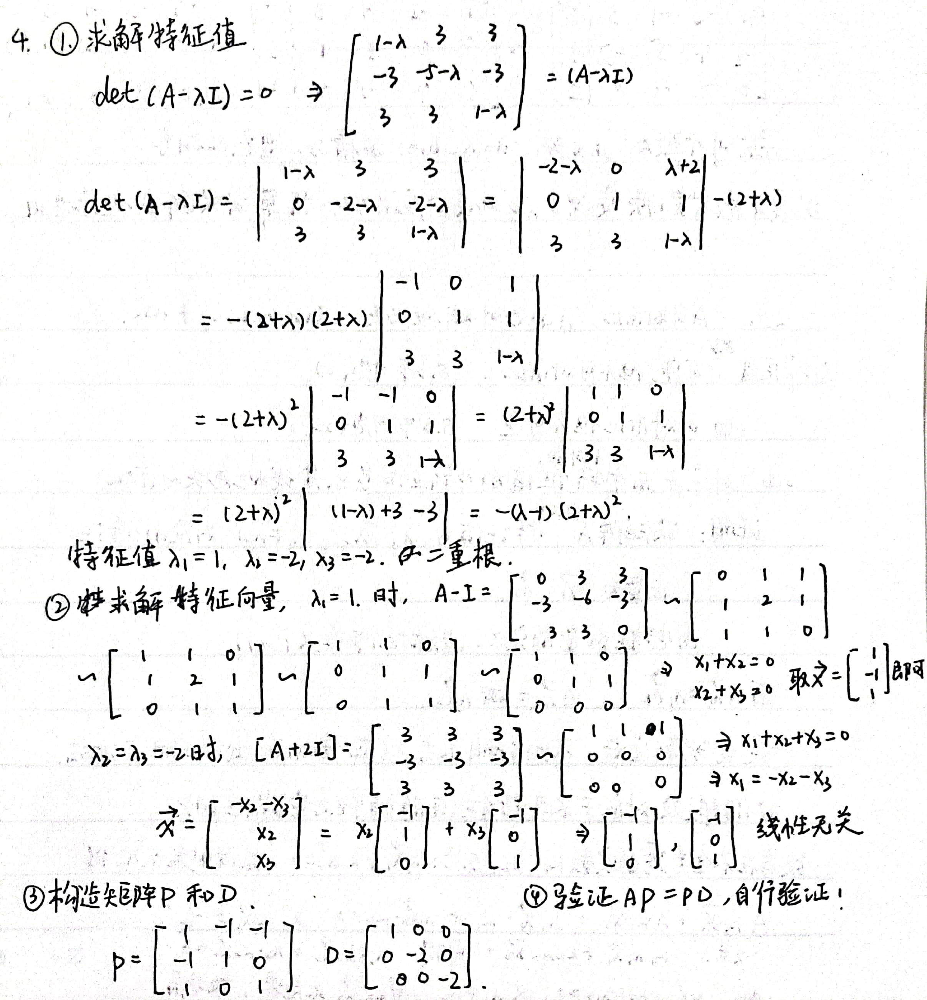
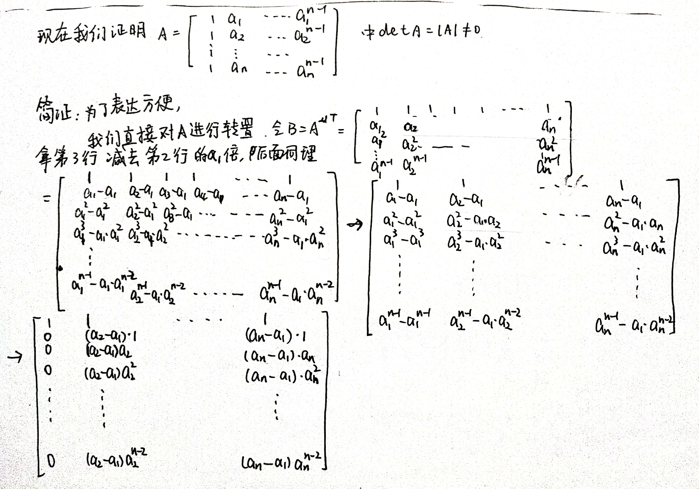
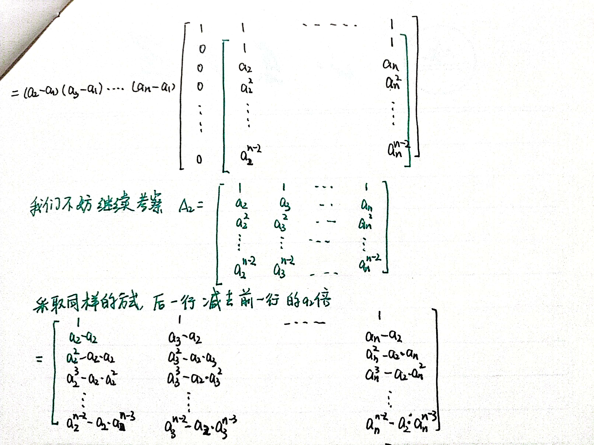
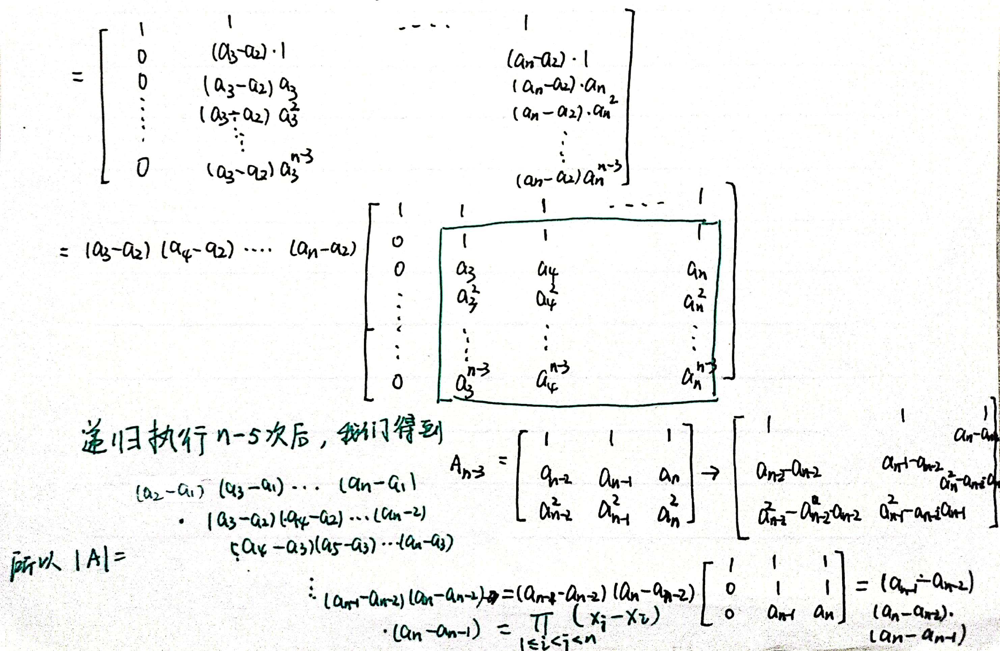

### Linear Algebra 04

时间：2022年4月28日

1. Find the general solution of the system
   $$
   \begin{array}{r}
   x_{1}-2 x_{2}-x_{3}+3 x_{4}=0 \\
   -2 x_{1}+4 x_{2}+5 x_{3}-5 x_{4}=3 \\
   3 x_{1}-6 x_{2}-6 x_{3}+8 x_{4}=2
   \end{array}
   $$
   [解答]

   Row reduce the system's augmented matrix:
   $$
   \begin{aligned}
   {\left[\begin{array}{rrrrr}
   1 & -2 & -1 & 3 & 0 \\
   -2 & 4 & 5 & -5 & 3 \\
   3 & -6 & -6 & 8 & 2
   \end{array}\right] \sim } & \sim\left[\begin{array}{rrrrr}
   1 & -2 & -1 & 3 & 0 \\
   0 & 0 & 3 & 1 & 3 \\
   0 & 0 & -3 & -1 & 2
   \end{array}\right] \\
   & \sim\left[\begin{array}{rrrrr}
   1 & -2 & -1 & 3 & 0 \\
   0 & 0 & 3 & 1 & 3 \\
   0 & 0 & 0 & 0 & 5
   \end{array}\right]
   \end{aligned}
   $$
   This echelon matrix shows that the system is inconsistent, because its rightmost column is a pivot column; the third row corresponds to the equation $0=5$. There is no need to perform any more row operations. Note that the presence of the free variables in this problem is irrelevant because the system is inconsistent.
   
   
   
2. a. If a matrix **A** is diagonalizable, then the columns of **A** are linearly dependent. (T/F?)

   如果一个矩阵A是可对角化的，则A的列线性相关。（False）

   

   b. Two eigenvectors corresponding to the distinct eigenvalues are always linearly independent. (T/F?)

   对应于不同特征值的两个特征向量总是线性无关的。（True）

   

   c. A 3x3 matrix **A** with 3 linearly dependent eigenvectors is invertible. (T/F?)

   一个有3个线性相关特征向量的3x3的矩阵A是可逆的。(False)

   

3. 如果题2(b)是错误的，请修改为正确的并证明题2(b)；如果题2(b)是正确的，请证明之。

   [解答]

   [如何理解不同特征值对应的特征向量线性无关？ - 知乎 (zhihu.com)](https://zhuanlan.zhihu.com/p/30454490)

   问题：为什么不同特征值对应的特征向量线性无关?
   解答: 首先我们对于矩阵 $A$ 的特征值 $\lambda_{1}$ ，有等式满足 $A x_{1}=\lambda_{1} x_{1}$ ，特征向量为 $x_{1}$.
   对于特征值 $\lambda_{2}$ ，有等式满足 $A x_{2}=\lambda_{2} x_{2}$ 。
   下面用反证法进行证明! 首先假设不同特征值对应的特征向量线性相关
   如果对于不同的 $\lambda_{1} ， \lambda_{2}$ 所对应的特征向量线性相关的话，那么满足下面等式:
   $k_{1} x_{1}+k_{2} x_{2}=0$ ，那么等式两边同时乘以矩阵 $\mathrm{A}$ ，得到 $A k_{1} x_{1}+A k_{2} x_{2}=0$ ，化简为:
   $\lambda_{1} k_{1} x_{1}+\lambda_{2} k_{2} x_{2}=0$ ， 又因为根据等式 $k_{1} x_{1}+k_{2} x_{2}=0$ 可以得到，
   $k_{2} x_{2}=-k_{1} x_{1}$ ，带入到 $\lambda_{1} k_{1} x_{1}+\lambda_{2} k_{2} x_{2}=0$ ，得到 $k_{1} x_{1}\left(\lambda_{1}-\lambda_{2}\right)=0$, 又因为 $\lambda_{1}, \lambda_{2}$ 不相同，则造成矛盾。
   所以不同特征值对应的特征向量线性相关是错误的。
   所以：不同特征值对应的特征向量是线性无关的

4. 已知
   $$
   \boldsymbol{A}=\left[\begin{array}{ccc}
   1 & 3 & 3 \\
   -3 & -5 & -3 \\
   3 & 3 & 1
   \end{array}\right]
   $$
      求可逆矩阵 $\boldsymbol{P}$ 和对角矩阵 $\boldsymbol{D}$, 使 $\boldsymbol{A}=\boldsymbol{P D} \boldsymbol{P}^{-1}$

   [解答]
   
   
   
   
   
   
   
   There are four steps to implement the description in Theorem 5 .
   
   
   
   Step 1. Find the eigenvalues of A. As mentioned in Section $5.2$, the mechanics of this step are appropriate for a computer when the matrix is larger than $2 \times 2$. To avoid unnecessary distractions, the text will usually supply information needed for this step. In the present case, the characteristic equation turns out to involve a cubic polynomial that can be factored:
   $$
   \begin{aligned}
   0=\operatorname{det}(A-\lambda I) &=-\lambda^{3}-3 \lambda^{2}+4 \\
   &=-(\lambda-1)(\lambda+2)^{2}
   \end{aligned}
   $$
   The eigenvalues are $\lambda=1$ and $\lambda=-2$.
   
   
   
   Step 2. Find three linearly independent eigenvectors of $A$. Three vectors are needed because $A$ is a $3 \times 3$ matrix. This is the critical step. If it fails, then Theorem 5 says that $A$ cannot be diagonalized. The method in Section $5.1$ produces a basis for each eigenspace:
   Basis for $\lambda=1: \quad \mathbf{v}_{1}=\left[\begin{array}{r}1 \\ -1 \\ 1\end{array}\right]$
   Basis for $\lambda=-2: \quad \mathbf{v}_{2}=\left[\begin{array}{r}-1 \\ 1 \\ 0\end{array}\right] \quad$ and $\quad \mathbf{v}_{3}=\left[\begin{array}{r}-1 \\ 0 \\ 1\end{array}\right]$
   You can check that $\left\{\mathbf{v}_{1}, \mathbf{v}_{2}, \mathbf{v}_{3}\right\}$ is a linearly independent set.
   
   
   
   Step 3. Construct P from the vectors in step 2. The order of the vectors is unimportant. Using the order chosen in step 2 , form
   $$
   P=\left[\begin{array}{lll}
   \mathbf{v}_{1} & \mathbf{v}_{2} & \mathbf{v}_{3}
   \end{array}\right]=\left[\begin{array}{rrr}
   1 & -1 & -1 \\
   -1 & 1 & 0 \\
   1 & 0 & 1
   \end{array}\right]
   $$
   
   
   Step 4. Construct D from the corresponding eigenvalues. In this step, it is essential that the order of the eigenvalues matches the order chosen for the columns of $P$. Use the eigenvalue $\lambda=-2$ twice, once for each of the eigenvectors corresponding to $\lambda=-2$ :
   $$
   D=\left[\begin{array}{rrr}
   1 & 0 & 0 \\
   0 & -2 & 0 \\
   0 & 0 & -2
   \end{array}\right]
   $$
   It is a good idea to check that $P$ and $D$ really work. To avoid computing $P^{-1}$, simply verify that $A P=P D$. This is equivalent to $A=P D P^{-1}$ when $P$ is invertible. (However, be sure that $P$ is invertible!) Compute
   $$
   \begin{aligned}
   A P &=\left[\begin{array}{rrr}
   1 & 3 & 3 \\
   -3 & -5 & -3 \\
   3 & 3 & 1
   \end{array}\right]\left[\begin{array}{rrr}
   1 & -1 & -1 \\
   -1 & 1 & 0 \\
   1 & 0 & 1
   \end{array}\right]=\left[\begin{array}{rrr}
   1 & 2 & 2 \\
   -1 & -2 & 0 \\
   1 & 0 & -2
   \end{array}\right] \\
   P D &=\left[\begin{array}{rrr}
   1 & -1 & -1 \\
   -1 & 1 & 0 \\
   1 & 0 & 1
   \end{array}\right]\left[\begin{array}{rrr}
   1 & 0 & 0 \\
   0 & -2 & 0 \\
   0 & 0 & -2
   \end{array}\right]=\left[\begin{array}{rrr}
   1 & 2 & 2 \\
   -1 & -2 & 0 \\
   1 & 0 & -2
   \end{array}\right]
   \end{aligned}
   $$
   
   
2. (选做)请仔细阅读下面的证明过程：
   $$
   T=\left[\begin{array}{lll}
   1 & a & a^{2} \\
   1 & b & b^{2} \\
   1 & c & c^{2}
   \end{array}\right]
   $$
    Show that $\operatorname{det} T=(b-a)(c-a)(c-b)$.

   [证明]

      $\begin{aligned} \operatorname{det} T &=\left|\begin{array}{lll}1 & a & a^{2} \\ 1 & b & b^{2} \\ 1 & c & c^{2}\end{array}\right|=\left|\begin{array}{ccc}1 & a & a^{2} \\ 0 & b-a & b^{2}-a^{2} \\ 0 & c-a & c^{2}-a^{2}\end{array}\right|=\left|\begin{array}{ccc}1 & a & a^{2} \\ 0 & b-a & (b-a)(b+a) \\ 0 & c-a & (c-a)(c+a)\end{array}\right| \\ &=(b-a)(c-a)\left|\begin{array}{ccc}1 & a & a^{2} \\ 0 & 1 & b+a \\ 0 & 1 & c+a\end{array}\right|=(b-a)(c-a)\left|\begin{array}{ccc}1 & a & a^{2} \\ 0 & 1 & b+a \\ 0 & 0 & c-b\end{array}\right|=(b-a)(c-a)(c-b) \end{aligned}$

   请仿照上述的证明思路及证明过程，证明如下结论：
   $$
   \boldsymbol{A}=\left[\begin{array}{ccccc}
   1 & a_{1} & a_{1}^{2} & \cdots & a_{1}^{n-1} \\
   1 & a_{2} & a_{2}^{2} & \cdots & a_{2}^{n-1} \\
   \vdots & \vdots & \vdots & & \vdots \\
   1 & a_{n} & a_{n}^{2} & \cdots & a_{n}^{n-1}
   \end{array}\right]
   $$
   Show that $\operatorname{det} A={\displaystyle{\prod}\limits_{0{\leq}i{<}j{\leq}n}}(x_j-x_i).$

   [证明]

   [范德蒙行列式 - 知乎 (zhihu.com)](https://zhuanlan.zhihu.com/p/161300510)

   

   

   

   