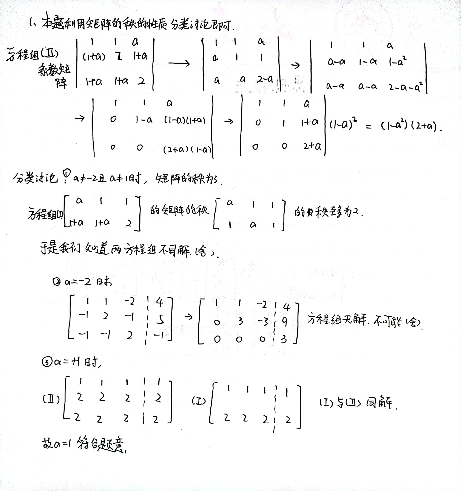
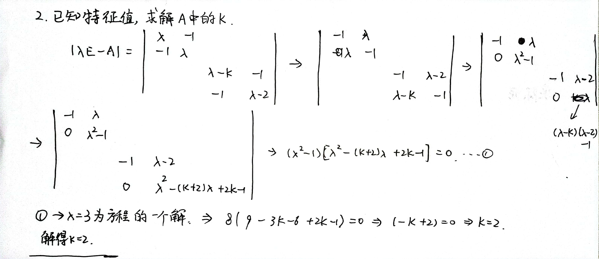
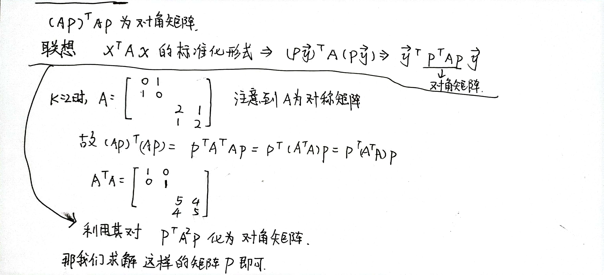

### Linear Algebra 08

时间：2022年5月26日

1. 若方程组

   $$
   \text { (I ) }\left\{\begin{array}{l}
   
   a x_{1}+x_{2}+x_{3}=a^{3}, \\
   
   (1+a) x_{1}+(1+a) x_{2}+2 x_{3}=a\left(a^{2}+1\right)
   
   \end{array}\right.

   $$
   
   
   与方程组
   
   $$ 
   
   \text { (II) }\left\{\begin{array}{l}
   
   x_{1}+x_{2}+a x_{3}=a^{2}, \\
   
   (1+a) x_{1}+2 x_{2}+(1+a) x_{3}=1+a^{2}, \\
   
   (1+a) x_{1}+(1+a) x_{2}+2 x_{3}=1+a
   
   \end{array}\right.
   $$

   同解, 计算A的值。

   【解析】

   
   
   对于方程组 (II), 其系数行列式
   $\left|\begin{array}{ccc}1 & 1 & a \\ 1+a & 2 & 1+a \\ 1+a & 1+a & 2\end{array}\right|=\left|\begin{array}{ccc}1 & 1 & a \\ a & 1 & 1 \\ 1+a & 1+a & 2\end{array}\right|=\left|\begin{array}{lll}1 & 1 & a \\ a & 1 & 1 \\ 1 & a & 1\end{array}\right|$
   $=(a+2)\left|\begin{array}{lll}1 & 1 & a \\ 1 & 1 & 1 \\ 1 & a & 1\end{array}\right|=(a+2)\left|\begin{array}{ccc}1 & 1 & a \\ 0 & 0 & 1-a \\ 0 & a-1 & 1-a\end{array}\right|$
   $=(a+2)(a-1)^{2}$.
   当 $a \neq-2$ 且 $a \neq 1$ 时, 行列式不为零, 方程组 (II) 必有唯一解; 此时对于方程组 (I), 对其系数矩阵作初等行变换, 有
   $$
   \left[\begin{array}{ccc}
   a & 1 & 1 \\
   1+a & 1+a & 2
   \end{array}\right] \rightarrow\left[\begin{array}{lll}
   a & 1 & 1 \\
   1 & a & 1
   \end{array}\right],
   $$
   系数矩阵的秩等于增广矩阵的秩 $(<3)$, 有无穷多解, 不符合题意, 舍去.
   当 $a=-2$ 时, 对方程组 (II) 的增广矩阵作初等行变换, 有
   $$
   \left[\begin{array}{ccc:c}
   1 & 1 & -2 & 4 \\
   -1 & 2 & -1 & 5 \\
   -1 & -1 & 2 & -1
   \end{array}\right] \rightarrow\left[\begin{array}{ccc:c}
   1 & 1 & -2 & 4 \\
   0 & 3 & -3 & 9 \\
   0 & 0 & 0 & 3
   \end{array}\right],
   $$
   系数矩阵的秩不等于增广矩阵的秩, 方程组 (II) 无解, 不符合题意, 舍去.
   当 $a=1$ 时, 方程组 (I) 的增广矩阵为
   $$
   \left[\begin{array}{lll:l}
   1 & 1 & 1 & 1 \\
   2 & 2 & 2 & 2
   \end{array}\right] ;
   $$
   方程组 (II) 的增广矩阵为
   $$
   \left[\begin{array}{lll:c}
   1 & 1 & 1 & 1 \\
   2 & 2 & 2 & 2 \\
   2 & 2 & 2 & 2
   \end{array}\right] .
   $$
   此时 ( I ) 与 (II) 同解.
   综上可得 $a=1$.
   
2. 设矩阵 $\boldsymbol{A}=\left[\begin{array}{llll}0 & 1 & 0 & 0 \\ 1 & 0 & 0 & 0 \\ 0 & 0 & k & 1 \\ 0 & 0 & 1 & 2\end{array}\right]$, 已知 $\boldsymbol{A}$ 的一个特征值为 3 .
   (1) 求 $k$;

   (2) 求矩阵 $\boldsymbol{P}$, 使 $(\boldsymbol{A P})^{\mathrm{T}}(\boldsymbol{A P})$ 为对角矩阵.
   
   
   
   

【解析】   (1) 矩阵 $A$ 的特征多项式为
$$
|\lambda \boldsymbol{E}-\boldsymbol{A}|=\left|\begin{array}{cccc}
\lambda & -1 & 0 & 0 \\
-1 & \lambda & 0 & 0 \\
0 & 0 & \lambda-k & -1 \\
0 & 0 & -1 & \lambda-2
\end{array}\right|=\left(\lambda^{2}-1\right)\left[\lambda^{2}-(k+2) \lambda+(2 k-1)\right],
$$
将 $\boldsymbol{A}$ 的特征值 $\lambda=3$ 代人上式, 有
$$
|3 \boldsymbol{E}-\boldsymbol{A}|=\left(3^{2}-1\right)\left[3^{2}-3(k+2)+(2 k-1)\right]=0,
$$
解得 $k=2$.
(2) 由（1）的结果, 得矩阵
$$
\boldsymbol{A}=\left[\begin{array}{llll}
0 & 1 & 0 & 0 \\
1 & 0 & 0 & 0 \\
0 & 0 & 2 & 1 \\
0 & 0 & 1 & 2
\end{array}\right]
$$
因为 $A^{\mathrm{T}}=\boldsymbol{A}$, 所以
$$
(\boldsymbol{A P})^{\mathrm{T}}(\boldsymbol{A P})=\boldsymbol{P}^{\mathrm{T}} \boldsymbol{A}^{2} \boldsymbol{P},
$$
而
$$
\boldsymbol{A}^{2}=\left[\begin{array}{llll}
1 & 0 & 0 & 0 \\
0 & 1 & 0 & 0 \\
0 & 0 & 5 & 4 \\
0 & 0 & 4 & 5
\end{array}\right]
$$
对应于 $A^{2}$ 的二次型为
$$
\begin{aligned}
\boldsymbol{x}^{\mathrm{T}} \boldsymbol{A}^{2} \boldsymbol{x} &=x_{1}^{2}+x_{2}^{2}+5 x_{3}^{2}+5 x_{4}^{2}+8 x_{3} x_{4} \\
&=x_{1}^{2}+x_{2}^{2}+5\left(x_{3}+\frac{4}{5} x_{4}\right)^{2}+\frac{9}{5} x_{4}^{2}
\end{aligned}
$$
作线性变换
$$
\left\{\begin{array}{l}
y_{1}=x_{1}, \\
y_{2}=x_{2}, \\
y_{3}=x_{3}+\frac{4}{5} x_{4}, \\
y_{4}=x_{4},
\end{array}\right.
$$
即
$$
\boldsymbol{x}=\left[\begin{array}{l}
x_{1} \\
x_{2} \\
x_{3} \\
x_{4}
\end{array}\right]=\left[\begin{array}{c}
y_{1} \\
y_{2} \\
y_{3}-\frac{4}{5} y_{4} \\
y_{4}
\end{array}\right]=\left[\begin{array}{cccc}
1 & 0 & 0 & 0 \\
0 & 1 & 0 & 0 \\
0 & 0 & 1 & -\frac{4}{5} \\
0 & 0 & 0 & 1
\end{array}\right]\left[\begin{array}{l}
y_{1} \\
y_{2} \\
y_{3} \\
y_{4}
\end{array}\right]=\boldsymbol{P y},
$$
其中
$$
\boldsymbol{P}=\left[\begin{array}{cccc}
1 & 0 & 0 & 0 \\
0 & 1 & 0 & 0 \\
0 & 0 & 1 & -\frac{4}{5} \\
0 & 0 & 0 & 1
\end{array}\right], \boldsymbol{y}=\left[\begin{array}{l}
y_{1} \\
y_{2} \\
y_{3} \\
y_{4}
\end{array}\right]
$$
将 $\boldsymbol{x}=\boldsymbol{P} \boldsymbol{y}$ 代人二次型 $\boldsymbol{x}^{\mathrm{T}} \boldsymbol{A}^{2} \boldsymbol{x}$, 得
$$
\begin{aligned}
\boldsymbol{x}^{\mathrm{T}} \boldsymbol{A}^{2} \boldsymbol{x} &=(\boldsymbol{P} \boldsymbol{y})^{\mathrm{T}} \boldsymbol{A}^{2}(\boldsymbol{P} \boldsymbol{y})=\boldsymbol{y}^{\mathrm{T}}(\boldsymbol{A P})^{\mathrm{T}}(\boldsymbol{A P}) \boldsymbol{y} \\
&=\boldsymbol{y}^{\mathrm{T}}\left[\begin{array}{llll}
1 & 0 & 0 & 0 \\
0 & 1 & 0 & 0 \\
0 & 0 & 5 & 0 \\
0 & 0 & 0 & \frac{9}{5}
\end{array}\right] \boldsymbol{y}
\end{aligned}
$$
即矩阵 $\boldsymbol{P}$, 使得
$$
\boldsymbol{(A P})^{\mathrm{T}}(\boldsymbol{A P})=\left[\begin{array}{llll}
1 & 0 & 0 & 0 \\
0 & 1 & 0 & 0 \\
0 & 0 & 5 & 0 \\
0 & 0 & 0 & \frac{9}{5}
\end{array}\right]
$$

3. $$
   \text {若可逆矩阵 } \boldsymbol{D} \text { 满足 } \boldsymbol{D}^{\mathrm{T}} \boldsymbol{D}=\left[\begin{array}{ccc}
   1 & -1 & 1 \\
   -1 & 2 & -3 \\
   1 & -3 & 6
   \end{array}\right] \text {, 计算} \boldsymbol{D}.
   $$

   $\left[\begin{array}{ccc}1 & -1 & 1 \\ 0 & 1 & -2 \\ 0 & 0 & 1\end{array}\right]$ 【解析】方法一 记 $\left[\begin{array}{ccc}1 & -1 & 1 \\ -1 & 2 & -3 \\ 1 & -3 & 6\end{array}\right]=\boldsymbol{A}$, 则其对应的二次型为 $f\left(x_{1}, x_{2}, x_{3}\right)=\boldsymbol{x}^{\mathrm{T}} \boldsymbol{A} \boldsymbol{x}=x_{1}^{2}+2 x_{2}^{2}+6 x_{3}^{2}-2 x_{1} x_{2}+2 x_{1} x_{3}-6 x_{2} x_{3}$
   $$
   \begin{aligned}
   &=\left(x_{1}-x_{2}+x_{3}\right)^{2}+\left(x_{2}-2 x_{3}\right)^{2}+x_{3}^{2}=\left[x_{1}-x_{2}+x_{3}, x_{2}-2 x_{3}, x_{3}\right]\left[\begin{array}{c}
   x_{1}-x_{2}+x_{3} \\
   x_{2}-2 x_{3} \\
   x_{3}
   \end{array}\right] \\
   &=\left[x_{1}, x_{2}, x_{3}\right]\left[\begin{array}{ccc}
   1 & 0 & 0 \\
   -1 & 1 & 0 \\
   1 & -2 & 1
   \end{array}\right]\left[\begin{array}{ccc}
   1 & -1 & 1 \\
   0 & 1 & -2 \\
   0 & 0 & 1
   \end{array}\right]\left[\begin{array}{l}
   x_{1} \\
   x_{2} \\
   x_{3}
   \end{array}\right] \text { 记 }\left[x_{1}, x_{2}, x_{3}\right] D^{\mathrm{T}} \boldsymbol{D}\left[\begin{array}{l}
   x_{1} \\
   x_{2} \\
   x_{3}
   \end{array}\right],
   \end{aligned}
   $$
   其中 $\boldsymbol{A}=\boldsymbol{D}^{\mathrm{T}} \boldsymbol{D}, \boldsymbol{D}=\left[\begin{array}{ccc}1 & -1 & 1 \\ 0 & 1 & -2 \\ 0 & 0 & 1\end{array}\right]$.

方法二、 在方法一中, $f\left(x_{1}, x_{2}, x_{3}\right)=x^{\mathrm{T}} \boldsymbol{A x}=\left(x_{1}-x_{2}+x_{3}\right)^{2}+\left(x_{2}-2 x_{3}\right)^{2}+x_{3}^{2}$, 令 $\left\{\begin{array}{l}x_{1}-x_{2}+x_{3}=y_{1}, \\ x_{2}-2 x_{3}=y_{2}, \\ x_{3}=y_{3},\end{array}\right.$ 则 $f\left(x_{1}, x_{2}, x_{3}\right)=y_{1}^{2}+y_{2}^{2}+y_{3}^{2}$, 也即作可逆线性变换 $x=C y$, 其中 $\left[\begin{array}{ccc}1 & -1 & 1 \\ 0 & 1 & -2 \\ 0 & 0 & 1\end{array}\right]\left[\begin{array}{l}x_{1} \\ x_{2} \\ x_{3}\end{array}\right]=\left[\begin{array}{l}y_{1} \\ y_{2} \\ y_{3}\end{array}\right]$, 得 $\boldsymbol{C}=\left[\begin{array}{ccc}1 & -1 & 1 \\ 0 & 1 & -2 \\ 0 & 0 & 1\end{array}\right]^{-1}$, 因此
$$
f=\boldsymbol{x}^{\mathrm{T}} \boldsymbol{A} \boldsymbol{x}=\boldsymbol{y}^{\mathrm{T}} \boldsymbol{C}^{\mathrm{T}} \boldsymbol{A} \boldsymbol{C} \boldsymbol{y}=\boldsymbol{y}^{\mathrm{T}} \boldsymbol{E} \boldsymbol{y},
$$
故 $\boldsymbol{C}^{\mathrm{T}} \boldsymbol{A} \boldsymbol{C}=\boldsymbol{E}$, 则 $\boldsymbol{A}=\left(\boldsymbol{C}^{-1}\right)^{\mathrm{T}} \boldsymbol{C}^{-1}=\boldsymbol{D}^{\mathrm{T}} \boldsymbol{D}$, 故 $\boldsymbol{D}=\boldsymbol{C}^{-1}=\left[\begin{array}{ccc}1 & -1 & 1 \\ 0 & 1 & -2 \\ 0 & 0 & 1\end{array}\right]$.
【注】所求的矩阵 $\boldsymbol{D}$ 不唯一.