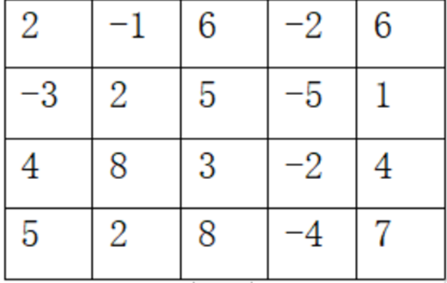

### Test 6(Week 16)

1. 如图m*n方格矩阵$a[m][n]$中摆放着价值不等的宝贝（价值可正可负），从左上角$a[0][0]$出发到达右下角$a[m-1][n-1]$，可以向右或向下走到相邻格子，并捡起当前格子的宝贝（无论价值的正负），每个格子只能走一遍，求能捡到宝贝价值之和的最大值。

   

   （1）按动态规划算法的解题过程，写出递推关系式。（6分）

   （2）根据递推关系式，写出递归型的动态规划函数。（6分）


2. 解释“归约”的概念并证明顶点覆盖归约到集合覆盖


3. ```c++
   int BSearch(elemtype a[], elemtype x, int low, int high)
       if (low > high) return -1;
       int mid = (low + high) / 2;
       if (x == a[mid]) 
           return mid;
       if (x < a[mid])
           return BSearch(a, x, low, mid - 1);
       else 
           return BSearch(a, x, mid + 1, high);
   ```

   分析算法时间复杂性，列出递归方程


4. 设有$n$项独立的作业，由$m$台相同的机器加工处理。作业$i$所需要的处理时间为$t_i$。约定：任何一项作业可在任何一台机器上处理，但未完工前不准中断处理；任何作业不能拆分更小的子作业。为多机调度问题设计一种调度算法，使所给的$n$个作业在尽可能短的时间内由$m$台机器处理完。（10分）