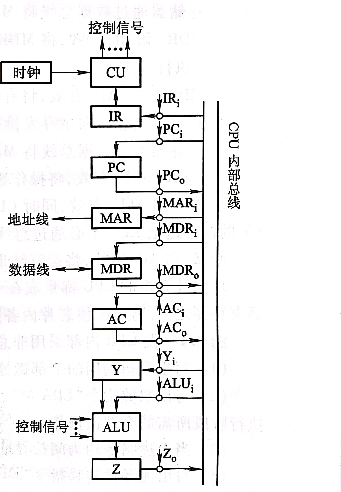

### Test 5 (Week 13)

1. 中断周期前是什么阶段？中断周期后又是什么阶段？在中断周期CPU应完成什么操作？

2. 什么是指令周期、机器周期和时钟周期？三者有何关系？

3. 某CPU的主频为10MHz，若已知每个机器周期平均包含4个时钟周期，该机的平均指令执行速度为1 MIPS，试求该机的平均指令周期及每个指令周期含几个机器周期？若改用时钟周期为0.4μs的CPU芯片，则计算机的平均指令执行速度为多少MIPS？若要得到平均每秒80万次的指令执行速度，则应采用主频为多少的CPU芯片？

4. 设CPU内有下列部件：PC、IR、SP、AC、MAR、MDR和CU。采用单总线连接。
   
   （1）画出完成间接寻址的取数指令LDA@X（将主存某地址单元X的内容取至AC中）的数据流（从取指令开始）。
   
   （2）画出中断周期的数据流。

5. 设CPU内部结构如图所示，此外还设有R1~R4四个寄存器，它们各自的输入和输出端都与内部总线相通，并分别受控制信号控制（如R2i为寄存器R2的输入控制；R2o为R2的输出控制）。要求从取指令开始，写出完成指令
   SUB R1,@mem ； ((R1)-((mem)) ->R1，存储器间接寻址)  所需的全部微操作和控制信号。

    