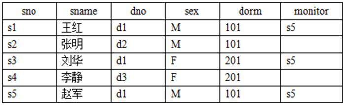
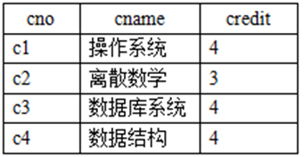
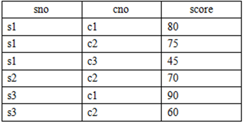
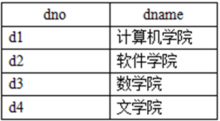

### Test 1 (Week 11)

1. 基于员工关系模式完成以下查询（关系数据语言）： 

   ```sql
   Employee(person_name, street, city) 
   
   Works(person_name,company_name,salary) 
   
   Company(company_name, city) 
   
   Manages(person_name,manager_name) 
   ```

    (1)找出与其经理居住在同一城市同一街道的员工 

    (2)找出不在First Bank Corporation公司工作的职工 

    (3)找出所有在经理’Jones’下工作的员工所居住的城市 


2. 有关系模式$S(sno,sanme,dno,sex,dorm,monitor),C(cno,cname,credit),SC(sno,cno,sore),D(dno,dname).$关系$S、C、SC$和$D$分别表示学生信息、课程信息、学生选课情况和院系信息。其属性分别表示如下：$sno$—学生编号，$sname$—学生姓名，$dno$—院系编号，$sex$—性别， $dorm$—宿舍， $monitor$—班长，$cno$—课程编号，$cname$—课程名称，$credit$—课程学分，$score$—成绩，$dname$—院系名称。 

    S

    

    C

    

    SC

    

    D

    

    用SQL完成：

    （1）查询软件学院学生姓名，按照学生姓名降序排序。

    （2）查询没有选修$c2$课程的学生学号。

    （3）查询自己的班长住在同一个宿舍的学生学号。


3. 设有一个工程供应数据库系统，包括如下四个关系模式：

   ```
   S(SNO，SNAME，STATUS，CITY)
   P(PNO，PNAME，COLOR，WEIGHT)
   J(JNO，JNAME，CITY)
   SPJ(SNO，PNO，JNO，QTY)
   ```

   ​		供应商表$S$由供应商号、供应商名、状态、城市组成；

   ​		零件表$P$ 由零件号、零件名、颜色、重量组成；

   ​		工程项目表J由项目号、项目名、城市组成；

   ​		供应情况表$SPJ$由供应商号、零件号、项目号、供应数量组成；

   （1）用关系代数查询没有使用天津供应商生产的红色零件的工程号；（3分）

   （2）用关系代数查询至少使用了供应商$S1$所供应的全部零件的工程号$JNO$；（3分）

   （3）用SQL查询供应工程$J1$零件为红色的供应商号$SNO$；（2分）


4. 如何理解空值（NULL），空值在参与运算时有哪些特点？