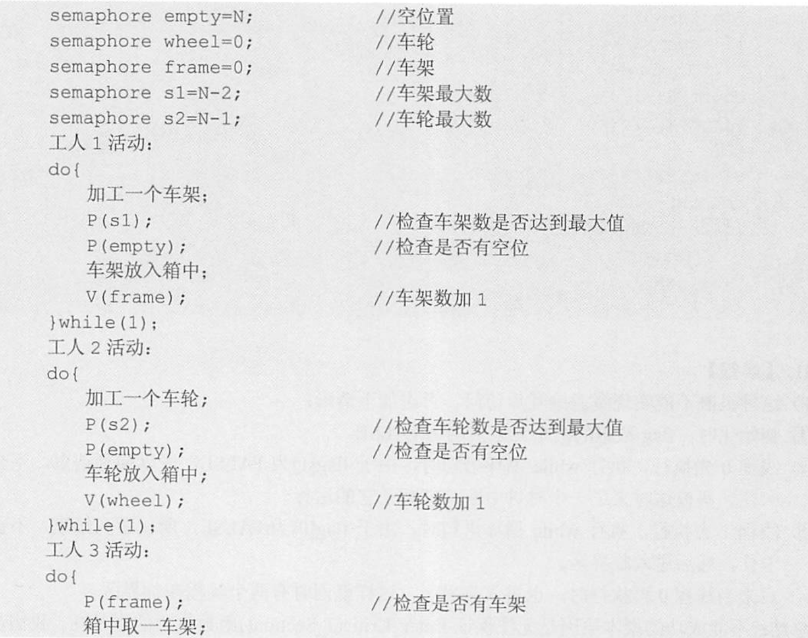
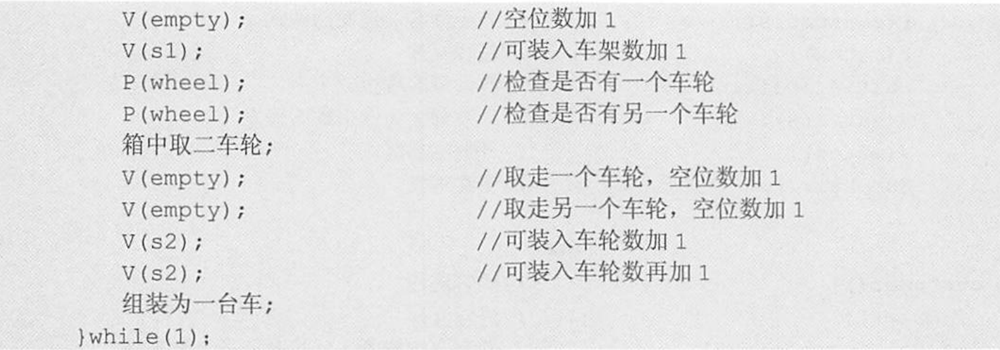
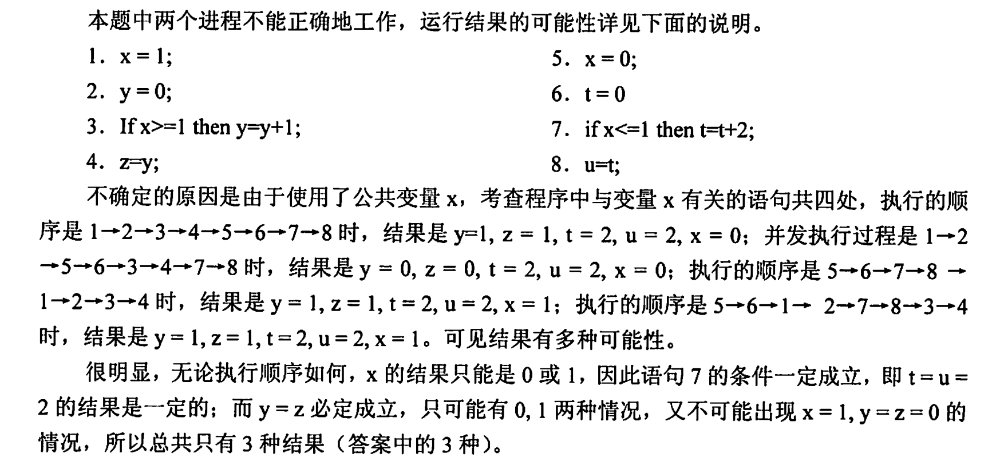

### Test 2 (Week 12)

1. 用户级线程和内核级线程是什么？相对的各自有什么优点？[2016]父进程创建子进程和主程序调用子程序有何不同？[进程管理]

   - 用户级线程和内核级线程是什么？相对的各自有什么优点？
   - 用户级线程由应用程序管理，操作系统内核感知不到用户线程的存在，在内核级线程中，管理工作由内核完成，应用程序没有进行线程管理的代码，只有到内核线程的编程接口。
   - 应用程序可以使用线程库设计成多线程程序,提高程序执行效率，内核级线程相较于进程来说，创建的开销较小，且线程之间容易切换、方便通信

   

   - 父进程创建子进程后，父进程与子进程同时执行（并发）。主程序调用子程序后，主程序暂停在调用点，子程序开始执行，直到子程序返回，主程序才开始执行。

2. 设自行车生产线上有一个箱子，其中有$N$个位置($N$≥3)，每个位置可存放一个车架或一个车轮，又设有3名工人，其活动分别为：

   ```c
   工人1活动：				工人2活动：				工人3活动：
   do{						do{						do{  箱中取一个车架；
   加工一个车架；				加工一个车轮：					箱中取二个车轮；
   车架放入箱中；				车轮放入箱中；					组装为一台车；
   }while(1)				}while(1)					}while(1)
   ```

   试分别用信号量与PV操作实现三名工人的合作，要求解中不含死锁。[进程互斥同步]

   - 用信号量与PV操作实现三名工人的合作。首先不考虑死锁问题，工人1与工人3、工人2与工人3构成生产者与消费者关系，这两对

     生产/消费关系通过共同的缓冲区相联系。从资源的角度来看，箱子中的空位置相当于工人1和工人2的资源，而车架和车轮相当于工人3的资源。

   - 分析上述解法易见，当工人1推进速度较快时，箱中空位置可能完全被车架占满或只留有一个存放车轮的位置，此时工人3同时取2个车轮将无法得到，而工人2又无法将新加工的车轮放入箱中；当工人2推进速度较快时，箱中空位置可能完全被车轮古满，而此时工人3取车架将无法得到，而工人1又无法将新加工的车架放入箱中。上述两种情况都意味着死锁。为防止死锁的发生，箱中车架的数量不可超过N-2,车轮的数量不可超过N-1,这些限制可以用两个信号量来表达。具体解答如下：

     

     


3. 有两个并发进程，对于如下这段程序的运行，进程是否会死锁，是否会”饥饿“？为什么？[进程死锁]

   ```c
   int x,y,z,t,u
    P1(){
        while(1){
            x = 1;
            y = 0;
            if x>=1 then y=y+1;
            z = y;
        }
    }
   
    P2(){
        while(1){
            x = 0;
            t = 0;
            if x<=1 then t=t+2;
            u = t;
        }
    }
   ```

   