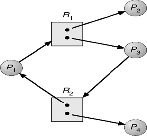

### Test 3 (Week 13)

1. [进程管理]解释多级队列调度和多级反馈队列调度算法的不同点，分析算法的优点在什么地方(比较多级队列和多级反馈队列的算法思想，并分析对比好处与坏处).

   - 多级队列调度算法：前述的各种调度算法，由于系统中仅设置一个进程的就绪队列，即调度算法是固定且单一的，无法满足系统中不同用户对进程调度策略的不同要求。在多处理机系统中，这种单一调度策略实现机制的缺点更为突出，多级队列调度算法能在一定程度上弥补这一缺点。该算法在系统中设置多个就绪队列，将不同类型或性质的进程固定分配到不同的就绪队列。每个队列可实施不同的调度算法，因此，系统针对不同用户进程的需求，很容易提供多种调度策略。同一队列中的进程可以设置不同的优先级，不同的队列本身也可以设置不同的优先级。在多处理机系统中，可以很方便为每个处理机设置一个单独的就绪队列，每个处理机可实施各自不同的调度策略，这样就能根据用户需求将多个线程分配到一个或多个处理机上运行。

   - 多级反馈队列调度算法的实现思想如下：

     1)设置多个就绪队列，并为每个队列赋予不同的优先级。第1级队列的优先级最高，第2级队列的优先级次之，其余队列的优先级逐个降低。

     2)赋予各个队列的进程运行时间片的大小各不相同。在优先级越高的队列中，每个进程的时间片就越小。例如，第i+1级队列的时间片要比第i级队列的时间片长1倍。

     3)每个队列都采用FCFS算法。当新进程进入内存后，首先将它放入第1级队列的末尾，按FCFS原则等待调度。当轮到该进程执行时，如它能在该时间片内完成，便可撤离系统。若它在一个时间片结束时尚未完成，调度程序将其转入第2级队列的末尾等待调度：若它在第2级队列中运行一个时间片后仍未完成，再将它放入第3级队列…，依此类推。当进程最后被降到第级队列后，在第n级队列中便采用时间片轮转方式运行。

     4)按队列优先级调度。仅当第1级队列为空时，才调度第2级队列中的进程运行：仅当第1~i-1级队列均为空时，才会调度第i级队列中的进程运行。若处理机正在执行第i级队列中的某进程时，又有新进程进入任一优先级较高的队列，此时须立即把正在运行的进程放回到第级队列的末尾，而把处理机分配给新到的高优先级进程。

     多级反馈队列的优势有以下几点：

     1)终端型作业用户：短作业优先。

     2)短批处理作业用户：周转时间较短。

     3)长批处理作业用户：经过前面几个队列得到部分执行，不会长期得不到处理。

2. [进程管理]系统中现有四个进程和两类资源，进程和资源的关系如下图。试分析目前系统中是否存在死锁进程，并说明理由。

   

   

   解答：由图可知，$R_1$资源和$R_2$资源已经全部分配完毕，首先考虑$P_2$，$P_2$不请求分配资源，进程$P_2$结束之后，会释放已经申请的资源，此时$P_1$申请的$R_1$资源可以得到满足，因此进程$P_1$运行结束之后释放与其相连的边，$P_3$申请资源$R_2$也可以得到满足，运行结束之后会释放与其相连的边，最后$P_4$进程运行结束之后也会释放与其相连的边，因此所有进程都可以运行完毕，故没有死锁进程。

3. [内存管理]带有快表（$TLB$）的分页（单级页表）系统中。快表内容如下，一页大小为2048字节.

   （1）在执行$MOV AX [2560]$, $MOV BX [8196]$指令时，请由逻辑地址$[2560]$,$[8196]$计算出物理地址。（5分）

   （2）设快表命中概率为90%，快表查询时间为5ns，内存访问时间为25ns，求有效内存访问时间。（5分）

   | **页号** | **块号** |
   | :------: | :------: |
   |    0     |    7     |
   |    1     |    30    |
   |    2     |    11    |
   |    3     |    56    |

   解答：物理地址 = 块号+页内地址

   （1）2048 = 1000 0000 0000 

   ​	2560 = 1010 0000 0000

   ​	8196 = 10 0000 0000 0100

   ​	由于 2560%2048 = 512，因此根据块表，页号为1对应的块号为30，页内地址为512 所以物理地址为 30*2048+512 = 61952

   ​	同理由于8196%2048 = 4 ，因此不再块表中，需要找到页号为4对应的物理块号，根据物理块号*2048+4 = 物理地址

   （2）90%*（5ns+25ns）+10%*（5ns+25ns+25ns） = 32.5ns