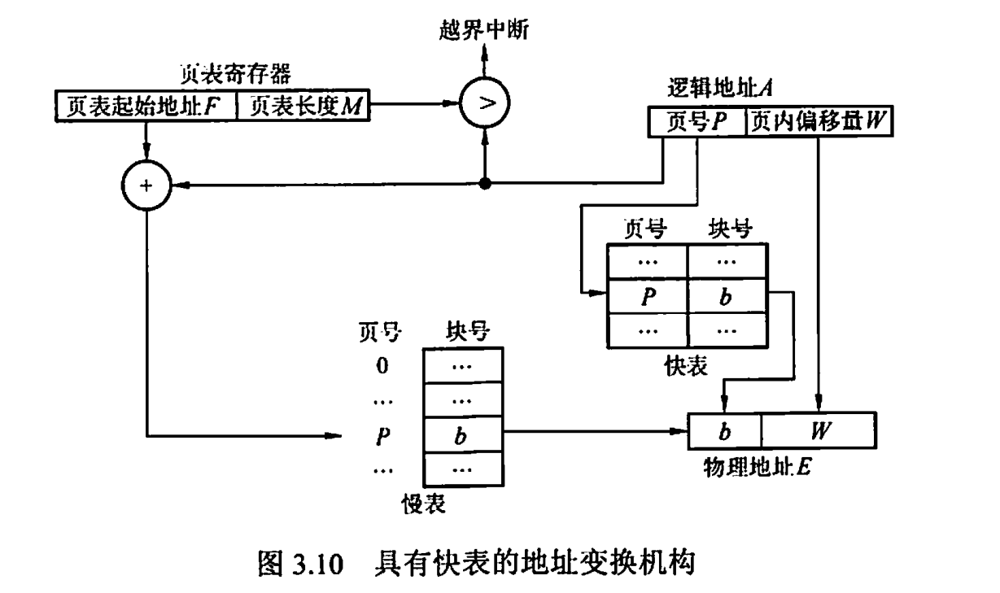
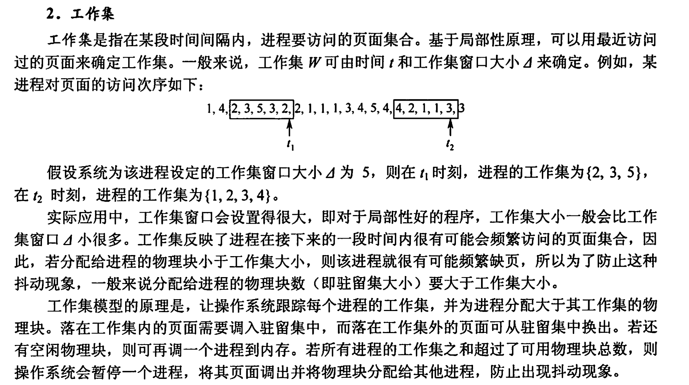

### Test 4 (Week 14)

1. [内存管理]带有快表（$TLB$）的分页（单级页表）系统中。快表内容如下，一页大小为2048字节.

   （1）在执行$MOV AX [2560]$, $MOV BX [8196]$指令时，请由逻辑地址$[2560]$,$[8196]$计算出物理地址。（5分）

   （2）设快表命中概率为90%，快表查询时间为5ns，内存访问时间为25ns，求有效内存访问时间。（5分）

   | **页号** | **块号** |
   | :------: | :------: |
   |    0     |    7     |
   |    1     |    30    |
   |    2     |    11    |
   |    3     |    56    |

2. [内存管理]当前页表如下。页大小为1024字节，该程序分配2个帧，页号0先装入内存。采用先进先出和局部置换策略，现在访问逻辑地址为3000的字节，问在这个过程中发生了什么主要事件并写出置换后的页表。

   | **页号** | **帧号** | **Valid/Invailid** |
   | :------: | :------: | :----------------: |
   |    0     |   130    |       Valid        |
   |    1     |   570    |       Valid        |
   |    2     |    -1    |      Invalid       |
   |    3     |    -1    |      Invalid       |

3. [内存管理]操作系统采用分页式存储管理方式，其中每个页面大小为64Byte，操作系统的物理地址和逻辑地址的寻址空间为64KB，由16位二进制位组成。采用两级页表的分页管理方式，包括一级页表和二级页表。（10分）[2022]

   (1)请问上述分配方式下一级页表和二级页表的逻辑地址的bit？一级页表和二级页表的大小以及页 表占用的存储空间大小；

   (2)描述一级页表和二级页表项的内容；

   (3)为加快操作系统的对内存的访问速度，引入TLB机制，请问TLB是如何加快操作系统对内存的访问速度的？

   - 由介绍的地址变换过程可知，若页表全部放在内存中，则存取一个数据或一条指令至少要访问两次内存：第一次是访问页表，确定所存取的数据或指令的物理地址；第二次是根据该地址存取数据或指令。显然，这种方法比通常执行指令的速度慢了一半。为此，在地址变换机构中增设一个具有并行查找能力的高速缓冲存储器一一快表，又称相联存储器（TLB），用来存放当前访问的若干页表项，以加速地址变换的过程。与此对应，主存中的页表常称为慢表。具有快表的地址变换机构如图3.10所示。

   - 

   - 在具有快表的分页机制中，地址的变换过程如下：
   - ①CPU给出逻辑地址后，由硬件进行地址转换，将页号送入高速缓存寄存器，并将此页号与快表中的所有页号进行比较。
   - ②若找到匹配的页号，说明所要访问的页表项在快表中，则直接从中取出该页对应的页框号，与页内偏移量拼接形成物理地址。这样，存取数据仅一次访存便可实现。
   - ③若未找到匹配的页号，则需要访问主存中的页表，读出页表项后，应同时将其存入快表，以便后面可能的再次访问。若快表已满，则须按特定的算法淘汰一个旧页表项。

   - 注意：有些处理机设计为快表和慢表同时查找，若在快表中查找成功则终止慢表的查找。
   - 一般快表的命中率可达90%以上，这样分页带来的速度损失就可降低至10%以下。快表的有效性基于著名的局部性原理，后面讲解虚拟内存时将会具体讨论它。

4. [内存管理]描述系统颠簸产生的原因，以及如何有效地消除或减轻颠簸现象的发生？请给出有效的解决方法 和评价解决方案的优点？（10分）[2022]

   - 在页面置换过程中，一种最糟糕的情形是，刚刚换出的页面马上又要换入主存，刚刚换入的页面马上又要换出主存，这种频繁的页面调度行为称为抖动或颠簸。

   - 系统发生抖动的根本原因是，系统中同时运行的进程太多，由此分配给每个进程的物理块太少，不能满足进程正常运行的基本要求，致使每个进程在运行时频繁地出现缺页，必须请求系统将所缺页面调入内存。这会使得在系统中排队等待页面调入/调出的进程数目增加。显然，对磁盘的有效访问时间也随之急剧增加，造成每个进程的大部分时间都用于页面的换入/换出，而几乎不能再去做任何有效的工作，进而导致发生处理机的利用率急剧下降并趋于零的情况。

   - 抖动是进程运行时出现的严重问题，必须采取相应的措施解决它。由于抖动的发生与系统为进程分配物理块的多少有关，于是又提出了关于进程工作集的概念。

     

