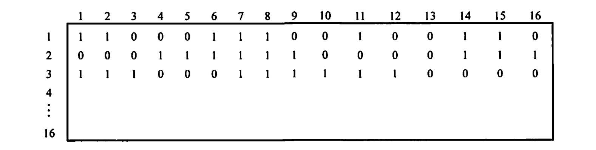

### Test 6(Week 16)

1. [I/O管理]I/O方式中，简述轮询、中断、DMA方式的机制和各自优缺点，并给出一个外部空闲空间分配和回收的方案。（10分）[2022]

   - 轮询：计算机从外部设备读取的每个字，CPU需要对外设状态进行循环检查，直到确定该字已经在I/O控制器的数据寄存器中。在程序直接控制方式中，由于CPU的高速性和I/O设备的低速性，致使CPU的绝大部分时间都处于等待I/O设备完成数据I/O的循环测试中，造成了CPU资源的极大浪费。在该方式中，CPU之所以要不断地测试I/O设备的状态，就是因为在CPU中未采用中断机构，使I/O设备无法向CPU报告它已完成了一个字符的输入操作。程序直接控制方式虽然简单且易于实现，但其缺点也显而易见，由于CPU和I/O设备只能串行工作，导致CPU的利用率相当低。
   - 中断：中断驱动方式的思想是，允许I/O设备主动打断CPU的运行并请求服务，从而“解放”CPU,使得其向I/O控制器发送读命令后可以继续做其他有用的工作。我们从I/O控制器和CPU两个角度分别来看中断驱动方式的工作过程。从I/O控制器的角度来看，I/O控制器从CPU接收一个读命令，然后从外部设备读数据。一旦数据读入I/O控制器的数据寄存器，便通过控制线给CPU发出中断信号，表示数据已准备好，然后等待CPU请求该数据。I/O控制器收到CPU发出的取数据请求后，将数据放到数据总线上，传到CPU的寄存器中。至此，本次I/O操作完成，I/O控制器又可开始下一次I/O操作。从CPU的角度来看，CPU发出读命令，然后保存当前运行程序的上下文（现场，包括程序计数器及处理机寄存器），转去执行其他程序。在每个指令周期的末尾，CPU检查中断。当有来自I/O控制器的中断时，CPU保存当前正在运行程序的上下文，转去执行中断处理程序以处理该中断。这时，CPU从I/O控制器读一个字的数据传送到寄存器，并存入主存。接着，CPU恢复发出I/O命令的程序（或其他程序）的上下文，然后继续运行。中断驱动方式比程序直接控制方式有效，但由于数据中的每个字在存储器与I/O控制器之间的传输都必须经过CPU,这就导致了中断驱动方式仍然会消耗较多的CPU时间。
   - DMA：在中断驱动方式中，I/O设备与内存之间的数据交换必须要经过CPU中的寄存器，所以速度还是受限，而DMA（直接存储器存取）方式的基本思想是在I/O设备和内存之间开辟直接的数据交换通路，彻底“解放”CPU。DMA方式与中断方式的主要区别是，中断方式在每个数据需要传输时中断CPU,而DMA方式则是在所要求传送的一批数据全部传送结束时才中断CPU;此外，中断方式的数据传送是在中断处理时由CPU控制完成的，而DMA方式则是在DMA控制器的控制下完成的。
   - 分配和回收的方案见题目3.


2. [I/O管理]非阻塞和阻塞I/O是什么，主要有什么不同，分别用在哪里.

   操作系统的I/O接口还涉及两种模式：阻塞和非阻塞。

   阻塞I/O是指当用户进程调用I/O操作时，进程就被阻塞，需要等待I/O操作完成，进程才被唤醒继续执行。

   非阻塞I/O是指用户进程调用I/O操作时，不阻塞该进程，该I/O调用返回一个错误返回值，通常，进程需要通过轮询的方式来查询I/O操作是否完成。比如：打印机的输入和输出。

   大多数操作系统提供的I/O接口都是采用阻塞I/O。等待I/O操作完成，将数据读入内存等等


3. [文件管理]以磁盘外存空间为例，设计高效的空闲块分配、回收算法，给出设计思想，操作方法，数据结构。（10分）

   - 位图

     - 位示图是利用二进制的一位来表示磁盘中一个盘块的使用情况，磁盘上所有的盘块都有一个二进制位与之对应。当其值为“0”时，表示对应的盘块空闲：为“1”时，表示已分配。这样，一个m×n位组成的位示图就可用来表示m×n个盘块的使用情况：
     - 盘块的分配：
       1)顺序扫描位示图，从中找出一个或一组其值为“0”的二进制位。
       2)将找到的一个或一组二进制位，转换成与之对应的盘块号。若找到的其值为“0”的二进制位位于位示图的第i行、第j列，则其相应的盘块号应按下式计算(n为每行位数)：$b=n(i-1)+j$.
     - 盘块的回收：
       1)将回收盘块的盘块号转换成位示图中的行号和列号。转换公式为：
       $i=(b-1)DIVn+1$
       $j=(b-1)MODn+1$
       2)修改位示图，令$map[i,j]=0$.
       空闲表法和空闲链表法都不适用于大型文件系统，因为这会使空闲表或空闲链表太大。

   - 链表

     - 将所有空闲盘区拉成一条空闲链。根据构成链所用基本元素的不同，分为两种形式：
     - 1)空闲盘块链。将磁盘上的所有空闲空间以盘块为单位拉成一条链。当用户因创建文件而请求分配存储空间时，系统从链首开始，依次摘下适当数目的空闲盘块分配给用户。当用户因删除文件而释放存储空间时，系统将回收的盘块依次插入空闲盘块链的末尾。这种方法的优点是分配和回收一个盘块的过程非常简单，但在为一个文件分配盘块时可能要重复操作多次，效率较低。又因它是以盘块为单位的，空闲盘块链会很长。
     - 2)空闲盘区链。将磁盘上的所有空闲盘区（每个盘区可包含若干个盘块）拉成一条链。每个盘区除含有用于指示下一个空闲盘区的指针外，还应有能指明本盘区大小（盘块数）的信息。分配盘区的方法与内存的动态分区分配类似，通常采用首次适应算法。在回收盘区时，同样也要将回收区与相邻接的空闲盘区合并。这种方法的优缺点刚好与第一种方法的相反，即分配与回收的过程比较复杂，但效率通常较高，且空闲盘区链较短。

   - 块组链表

     对空闲链表的一个改进是将n个空闲块的地址存在第一个空闲块中。这些块中的前n-1个确实为空，而最后一块包含另外n个空闲块的地址，如此继续。大量空闲块的地址可以很快地找到，这一点有别于标准链表方法。

   - 第一空闲块+计数

     另外一种方法是利用这样一个事实：通常，有多个连续块需要同时分配或释放，尤其是在使用连续分配和采用簇时更是如此。因此，不是记录个空闲块的地址，而是可以记录第一块的地址和紧跟第一块的连续的空闲块的数量。这样，空闲空间表的每个条目包括磁盘地址和数量。虽然每个条目会比原来需要更多空间，但是表的总长度会更短，这是因为连续块的数量常常大于1。


4. [进程管理]在一个仓库中可以存放A和B两种产品，要求:

   ①每次只能存入一种产品。

   ②A产品数量-B产品数量 <M。

   ③B产品数量-A产品数量<N。
   
   其中，M,N是正整数，试用 P操作、V操作描述产品 A 与产品 B 的入库过程。

   [解答] 使用信号量mutex控制两个进程互斥访问临界资源（仓库），使用同步信号量Sa和Sb(分别代表产品A与B的还可容纳的数量差，以及产品B与A的还可容纳的数量差）满足条件2和条件3。代码如下：

   ```c
   Semaphore Sa=M-1,Sb=N-1;
   Semaphore mutex=1;
   //访问仓库的互斥信号量
   process A(){										process B(){
   	while(1){												while(1){
   			P(Sa);												P(Sb);
   			P(mutex);											P(mutex);
           	A产品入库;									 		  B产品入库;
   			V(mutex);											V(mutex);
   			V(Sb);												V(Sa);
   		}													}
       }													}
   ```
