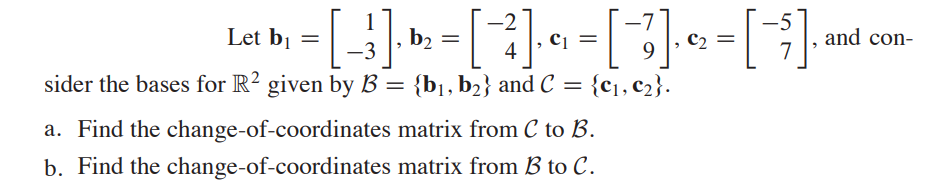

#### Linear Algebra
时间:2022年04月04日

一、判断正误
1. Every matrix is row equivalent to a unique matrix in echelon form.
2. If $A$ is an invertible $ n{\times} n $ matrix, then the equation $Ax = b$ is consistent for each $b$ in ${\R}^n$.

二、计算

1. Find bases for $Nul A$ and $Col A$.

    a.
    $$
    A =
   \begin{bmatrix}
   -2&4&-2&-4\\
   2&-6&-3&1\\
   -3&8&2&-3\\
   \end{bmatrix}\\
    $$
    b.
    $$
    A =
   \begin{bmatrix}
   1&2&0&4&5\\
   0&0&5&-7&8\\
   0&0&0&0&-9\\
   0&0&0&0&0\\
   \end{bmatrix}\\
    $$

2.
   

三、证明
1. 设$A$是$n$阶矩阵，若$A^2 = A$，证明$A+E$可逆.
2. 设$A$是$m{\times}n$矩阵，$B$是$n{\times}s$矩阵，若$AB=O$，证明$rank(A)+rank(B){\leq}n$.
