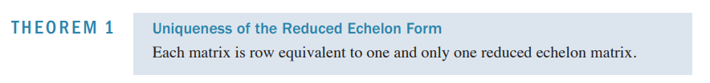

#### 2021年春线性代数(双语)考试原题

一．概念题。

1. 判䉼题 ( 10 分)

   Mark each statement True or False.

   (1) Every matrix is row equivalent to a unique matrix in echelon form. (False)

   [解析]教材13页定理一

   每个矩阵行等价于唯一的简化阶梯型矩阵。
   

   (2) A $3 \times 3$ matrix $A$ with 3 linearly dependent eigenvectors is invertible. ()

   (3) If $A$ is a $n \times n$ matrix, then $\operatorname{det}(5 A)=5 n \operatorname{det}(A)$. ()

   (4) The set of all linear combinations of $\alpha_{1}, \alpha_{2}, \cdots, \alpha_{n}$ is a vector space. ()

   (5) If the matrix $A$ contains a row of zeros, then 0 is an eigenvalue of $A$. ()

   (6) A matrix $A$ is orthogonally diagonalizable if and only if $A$ is symmetric. ()

   (7) If a matrix $A$ is diagonalizable, then the columns of $A$ are linearly dependent. ()

   (8) If none of the vectors in the set $S=\left\{\alpha_{1}, \alpha_{2}, \alpha_{3}\right\}$ is a linear combination of the other vectors, then $S$ is linearly independent. ( )

   (9) $\operatorname{Rank} A=\operatorname{dim}(\operatorname{Nul} A)$. ()

   (10) Two eigenvectors corresponding to the distinct eigenvalues are always linearly independent. ()

   

   | 判断题 |  1   |  2   |  3   |  4   |  5   |  6   |  7   |  8   |  9   |  10  |
   | :----: | :--: | :--: | :--: | :--: | :--: | :--: | :--: | :--: | :--: | :--: |
   |  答案  |      |      |      |      |      |      |      |      |      |      |

   

2. 填空题 (共 5 小题, 每题 3 分, 共 15 分)

   

   (1) $\boldsymbol{A}$ 和 $\boldsymbol{B}$ 都是 $m \times n$ 的矩阵, 且 $m>n, r(\boldsymbol{A})=\mathrm{r}(\boldsymbol{B})=n$ 。小冼说: $\operatorname{Col}(\boldsymbol{A})=$ $\operatorname{Col}(\boldsymbol{B})$ 。小邢说: $\operatorname{Row}(\boldsymbol{A})=\operatorname{Row}(\boldsymbol{B})$ 。小代说: $\operatorname{Row}\left(\boldsymbol{A}^{\mathrm{T}}\right)=\operatorname{Row}\left(\boldsymbol{B}^{\mathrm{T}}\right)$ 。小舒说: $\operatorname{Nul}\left(\mathbf{A}^{T}\right)$ $=\operatorname{Nul}\left(\mathbf{B}^{T}\right)$ 。则回答正确的是_____________________(只有一位)。

   

   (2) $A$ 是 $3 \times 3$ 矩阵, 其特征值为 $1,2,3$ 。则 $|A|=$_____________________.

   

   (3) 已知 $\alpha_{i}$ 和 $\beta_{j}$ 都是 4 维列向量, 且行列式 $\left|\alpha_{1}, \alpha_{2}, \alpha_{3}, \beta_{1}\right|=m,\left|\alpha_{1}, \alpha_{2}, \beta_{2}, \alpha_{3}\right|=$ $n$ 。则行列式 $\left|\alpha_{3}, \alpha_{2}, \alpha_{1}, \beta_{1}+\beta_{2}\right|=$_____________________.

   

   (4) 若向量 $\left[\begin{array}{c}0 \\ k \\ k^{2}\end{array}\right]$ 能由 $\left[\begin{array}{c}1+k \\ 1 \\ 1\end{array}\right] 、\left[\begin{array}{c}1 \\ 1+k \\ 1\end{array}\right] 、\left[\begin{array}{c}1 \\ 1 \\ 1+k\end{array}\right]$ 唯一线性表示, 则 $k$ 应满足的条件为_____________________.

   

   (5) 已知 0 是矩阵 $\left[\begin{array}{lll}1 & 0 & 1 \\ 0 & 2 & 0 \\ 1 & 0 & a\end{array}\right]$ 的特征值, 则 $a=$_____________________ 。该矩阵的另外两个特征值是_____________________ 和 _____________________.

| 填空题 |  1   |  2   |  3   |  4   | 5(1) | 5(2) | 5(3) |
| :----: | :--: | :--: | :--: | :--: | :--: | :--: | :--: |
|  答案  |      |      |      |      |      |      |      |

二. 计算题 (45 分)

1. 解线性方程组。

$$
\begin{aligned}
&x_{1}-2 x_{2}-x_{3}+3 x_{4}=0 \\
&-2 x_{1}+4 x_{2}+5 x_{3}-5 x_{4}=3 \\
&3 x_{1}-6 x_{2}-6 x_{3}+8 x_{4}=2
\end{aligned}
$$

​        [解析]本题为教材20页练习题2原题。

2. $A=\left[\begin{array}{lll}2 & 1 & 1 \\ 1 & 2 & 1 \\ 1 & 1 & 2\end{array}\right]$, 计算 $\boldsymbol{A}$ 的逆矩阵。

   [解析]本题考查逆矩阵的求法。

   

3. $A=\left[\begin{array}{ccc}1 / 6 & 1 / 2 & 1 / 3 \\ 1 / 2 & 1 / 4 & 1 / 4 \\ 1 / 3 & 1 / 4 & 5 / 12\end{array}\right]$, 计算 $\boldsymbol{A}$ 的特征多项式。

   

4. 计算矩阵 $A=\left[\begin{array}{lll}1 & 0 & 0 \\ 1 & 1 & 0 \\ 1 & 1 & 1 \\ 1 & 1 & 1\end{array}\right]$ 的 $\mathrm{QR}$ 分解。

   [解析]本题为教材355页例4的原题。

   

5. 已知 $a_{1}=\left[\begin{array}{c}1 \\ -3\end{array}\right], a_{2}=\left[\begin{array}{c}-2 \\ 4\end{array}\right], b_{1}=\left[\begin{array}{c}-9 \\ 1\end{array}\right], b_{2}=\left[\begin{array}{c}-5 \\ -1\end{array}\right]$ 以 以 $\boldsymbol{a}_{1} 、 \boldsymbol{a}_{2}$ 构成基 A, 以 $\boldsymbol{b}_{1}$ 、 $\boldsymbol{b}_{2}$ 构成基 $\mathrm{B}$ 。现有向量 $x=\left[\begin{array}{l}1 \\ 1\end{array}\right]$ 。
   计算 $\boldsymbol{x}$ 在基 A 之下的坐标向量 $[x]_{\mathrm{A}}, \boldsymbol{x}$ 在基 B 之下的坐标向量 $[\boldsymbol{x}]_{\mathrm{B}}$, 坐标变换矩阵$\boldsymbol{P}_{\mathrm{A} \leftarrow \mathrm{B}}$, 验证 $[\boldsymbol{x}]_{\mathrm{A}}=\boldsymbol{P}_{\mathrm{A} \leftarrow \mathrm{B}}[\boldsymbol{x}]_{\mathrm{B}}$ 。
   
   [解析]本题为教材240-241页例2和例3的综合。

三. 综合题 (30 分)。

1. 已知 $u_{1}=\left[\begin{array}{l}1 \\ 0 \\ 0\end{array}\right], \quad u_{2}=\left[\begin{array}{l}0 \\ 1 \\ 1\end{array}\right], \quad v_{1}=\left[\begin{array}{l}0 \\ 1 \\ 0\end{array}\right], \quad v_{2}=\left[\begin{array}{l}1 \\ 0 \\ 1\end{array}\right]$ 。
   计算 $\operatorname{Span}\left\{\boldsymbol{u}_{1}, \boldsymbol{u}_{2}\right\} \cap \operatorname{Span}\left\{\boldsymbol{v}_{1}, \boldsymbol{v}_{2}\right\}_{\text {。 }}$

   

2. 设二次多项式 (二次型） $Q(\boldsymbol{x})=3 x_{1}^{2}+6 x_{2}^{2}+3 x_{3}^{2}-4 x_{1} x_{2}+8 x_{1} x_{3}+4 x_{2} x_{3}$ 。
   (1)写出 $Q(x)$ 的矩阵表达。
   (2)找一个矩阵 $\boldsymbol{P}$, 做变量替换 $\boldsymbol{x}=\boldsymbol{P}_{\boldsymbol{y}}$, 使得到的新的二次多项式中不含有交义项。

   (3) 二次多项式 $Q(x)$ 是正定的（半正定的)，负定的（半负定的), 还是不定的?

四. 附加题 (10 分)

说明：共有 2 道附加题, 选择其中一道解答。本人选择第 ____________题。

(1) $\boldsymbol{A}$ 和 $\boldsymbol{B}$ 分别是 $m \times n$ 和 $n \times p$ 矩阵, 证明: $r(\boldsymbol{A B})+n \geq r(\boldsymbol{A})+r(\boldsymbol{B})$ 。

(2) 设 $\boldsymbol{Q}$ 是一个正定对称矩阵, $\lambda_{1}, \lambda_{2}, \ldots, \lambda_{n}$ 是它的 $n$ 个特征值, 满足 $\lambda_{1} \leq \lambda_{2} \leq \ldots \leq \lambda_{n}$ 。证明对于任意的 $n$ 维列向量 $\boldsymbol{x}$, 都有 $\frac{\left(\mathbf{x}^{T} \mathbf{x}\right)^{2}}{\left(\mathbf{x}^{T} \mathbf{Q} \mathbf{x}\right)\left(\mathbf{x}^{T} \mathbf{Q}^{-1} \mathbf{x}\right)} \geq \frac{4 \lambda_{n} \lambda_{1}}{\left(\lambda_{1}+\lambda_{n}\right)^{2}} 。$